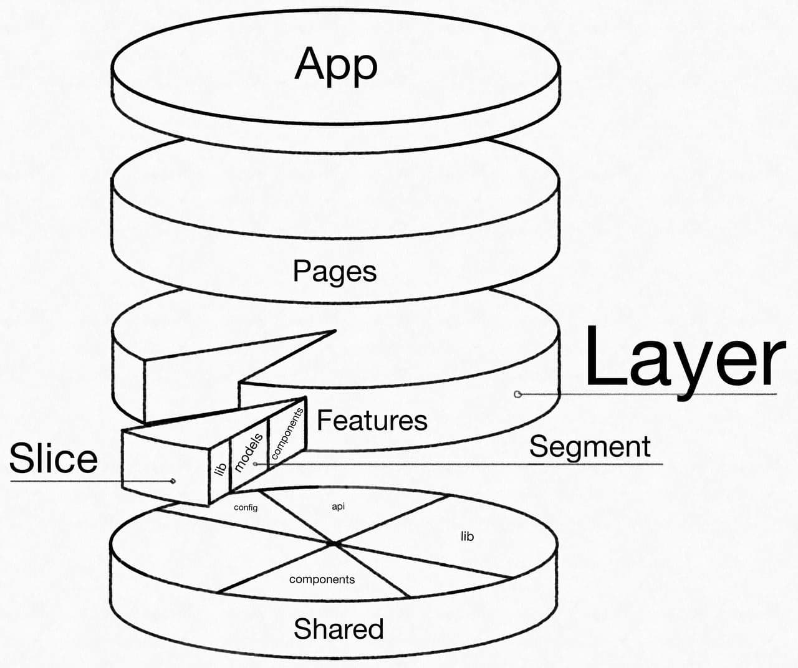
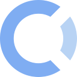

# feature-sliced

> `WIP:` Работа над методологией в процессе и окончательный вид *может поменяться*
>
> Пока *не рекомендуется** применять **текущую версию** в рабочих проектах 
>
> <sup>**только на свой страх и риск*</sup>

<!-- 🏅 Add badges -->

<!--
[npm]: https://www.npmjs.com/package/NPM_PACKAGE

[][npm]
[][npm]
[][npm]
[](https://hits.seeyoufarm.com)
[](https://github.com/OWNER/REPO/actions)
[](https://github.com/OWNER/REPO/commits)
-->

<!-- 🖼️ Add logo / primary image -->


<!-- ⚡ Add primary information & features about your repository -->
Методология для проектирования *frontend проектов*, нацеленная [**на разделение приложения согласно бизнес-логике и областям ответственности.**](concepts/app-splitting.md)

[refs-arch]: ./about/architecture.md
[refs-arch-req]: ./about/architecture.md#-требования
[refs-motivation]: ./about/motivation.md
[refs-motivation-why]: ./about/motivation.md#-почему-не-хватает-существующих-решений
[refs-ext-ubiq-lang]: https://thedomaindrivendesign.io/developing-the-ubiquitous-language

- Обеспечивает [**понятность, контролируемость и адаптивность**][refs-arch-req] архитектуры
- Основана на [**проверенных временем**][refs-motivation-why] практиках проектирования и концепциях
    > `SOLID`, `GRASP`, `DDD`, `Vertical Slices`, `Public API`, `Isolation`
- Предлагает разделять проект согласно [**бизнес-юнитам**][refs-ext-ubiq-lang]

## Motivation

Обычно, подходы построения архитектуры фронтенда от проекта к проекту - [переизобретаются с нуля](./about/motivation.md), пополняя тем самым ["проектные знания"](./references/knowledge-types.md)

> Несмотря на то, что специфика фронтенд-проектов отличается не так значительно

При этом, неверно принятые решения зачастую приводят [к проблемам масштабируемости проекта и команды](./about/architecture.md#%EF%B8%8F-проблемы).

И поэтому - вместо того, чтобы придумывать и документировать это каждый раз - хочется **обобщить опыт и сформировать рабочую, проверенную и задокументированную методологию** для проектирования архитектуры фронтенда.

> Да, практик и паттернов - много *(`SOLID`, `GRASP`, `DDD`, ...)*
>
> Но [крайне трудно найти](./about/motivation.md) устоявшиеся и конкретные подходы для фронтенда

## Overview

Методология призвана *упростить и стандартизировать декомпозицию логики для больших и долгоживужих проектов.*

В соответствие с ней, фронтенд-проекты становится проще поддерживать и адаптировать к возникающим новым условиям.

## Concepts

[`Public API`](./concepts/public-api.md), [`Isolation`](./concepts/cross-communication.md), ...

## Structure

> `WIP:` Нейминг групп временный, и будет определен окончательно ближе к релизу

<details>
<summary>Визуальная схема</summary>

> `WIP:` Схема - представляет лишь **примерное** разбиение проекта по модулям и будет определена окончательно ближе к релизу


</details>

```sh
└── src/
    ├── app/                    # Layer: Приложение
    |                           #
    ├── processes/              # Layer: Процессы (опционален)
    |   ├── {some-process}/     #     Slice: (н-р процесс CartPayment)
    |   |   ├── lib/            #         Segment: Инфраструктурная-логика (хелперы)
    |   |   └── model/          #         Segment: Бизнес-логика
    |   ...                     #
    |                           #
    ├── pages/                  # Layer: Страницы
    |   ├── {some-page}/        #     Slice: (н-р страница ProfilePage)
    |   |   ├── lib/            #         Segment: Инфраструктурная-логика (хелперы)
    |   |   ├── model/          #         Segment: Бизнес-логика
    |   |   └── ui/             #         Segment: UI-логика
    |   ...                     #
    |                           #
    ├── features/               # Layer: Фичи
    |   ├── {some-feature}/     #     Slice: (н-р фича AuthByPhone)
    |   |   ├── lib/            #         Segment: Инфраструктурная-логика (хелперы)
    |   |   ├── model/          #         Segment: Бизнес-логика
    |   |   └── ui/             #         Segment: UI-логика
    |   ...                     #
    |                           #
    ├── entities/               # Layer: Бизнес-сущности
    |   ├── {some-entity}/      #     Slice: (н-р сущность User)
    |   |   ├── lib/            #         Segment: Инфраструктурная-логика (хелперы)
    |   |   ├── model/          #         Segment: Бизнес-логика
    |   |   └── ui/             #         Segment: UI-логика
    |   ...                     #
    |                           #
    ├── shared/                 # Layer: Переиспользуемые ресурсы
    |   ├── api/                #         Segment: Логика запросов к API
    |   ├── lib/                #         Segment: Инфраструктурная-логика (хелперы)
    |   └── ui/                 #         Segment: UI-логика
    |   ...                     #
    |                           #
    └── index.tsx/              #
```

> Подробнее - ["Абстракции методологии"](./intro/abstractions.md) и ["Разбиение приложения"](./concepts/app-splitting.md)

## Further reading

<!--
TODO: Если ссылок будет потом оч много - вынести в переменные
-->

<!-- 
TODO: Перенести ссылки на референсы в /src/readme.md, как Карина добьет свой PR
-->

- `Get started` [Введение в методологию](./intro/readme.md)
- `About` [О методологии](./about/readme.md)
- `Misc` Прочие материалы
  - *Предыдущие* ответвления методологии: *[feature-slices](https://featureslices.dev/v1.0.html)*, *[feature-driven](./about/old/feature-driven/README.md)*
  - [Доклад React SPB Meetup#1 - Feature Slices](https://t.me/feature_slices)
  - [Feature Driven Architecture - Oleg Isonen](https://www.youtube.com/watch?v=BWAeYuWFHhs)
  - [A feature based approach to React development](https://ryanlanciaux.com/blog/2017/08/20/a-feature-based-approach-to-react-development/)
  - [Why React developers should modularize their applications?](https://alexmngn.medium.com/why-react-developers-should-modularize-their-applications-d26d381854c1)
  - [How to Organize Your React + Redux Codebase](https://www.pluralsight.com/guides/how-to-organize-your-react-+-redux-codebase)
  - [The Humanizing Work Guide to Splitting User Stories *(aka "Vetical Slices")*](https://www.humanizingwork.com/the-humanizing-work-guide-to-splitting-user-stories/)

<br/>

- `Discussions` [Дискуссии по методологии](https://github.com/feature-sliced/wiki/discussions)
  > **Здесь обсуждаются и разбираются рельные примеры применения, вопросы, проблемы, идеи методологии**
  >
  > Все это в совокупности влияет на спецификацию, тулкит и в целом - на дальнейшее видение и развитие методологии
  >
  > *Т.е. все, чего пока нет в спецификации/тулките - так или иначе обсуждается в github-discussions*
- `Contributing` **Как можно помочь?**
  - ⭐ Оцените нас на GitHub, если у вас остались положительные впечатления
    > Или если по-вашему этот проект должен развиваться дальше
  - 💫 Ознакомьтесь с нашим [contributing](./CONTRIBUTING.md) гайдом
    > **Важно любое содействие** - от *фидбека* до *участия в самой разработке!*

<!-- 
FIXME: Не удалось нормально justify-content:space-around применить в md
Если есть варики как лучше отступы расставить - welcome :)
-->

<!-- TODO: Добавить ссылкии, как доработаем ютуб и твиттер -->

<div align="center">

[](https://t.me/feature_sliced "Телеграм-чат")
&nbsp;&nbsp;&nbsp;&nbsp;&nbsp;&nbsp;&nbsp;&nbsp;
[](#wip "Twitter (в процессе)")
&nbsp;&nbsp;&nbsp;&nbsp;&nbsp;&nbsp;&nbsp;&nbsp;
[](https://opencollective.com/feature-sliced "OpenCollective профиль")
&nbsp;&nbsp;&nbsp;&nbsp;&nbsp;&nbsp;&nbsp;&nbsp;
[](#wip "YouTube канал (в процессе)")
</div>
