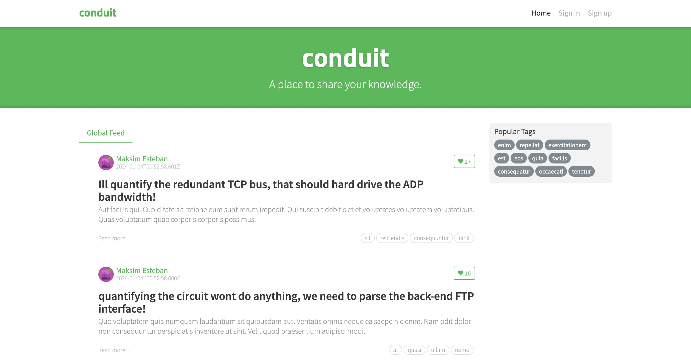
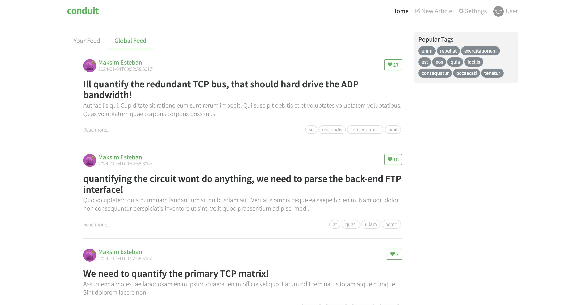
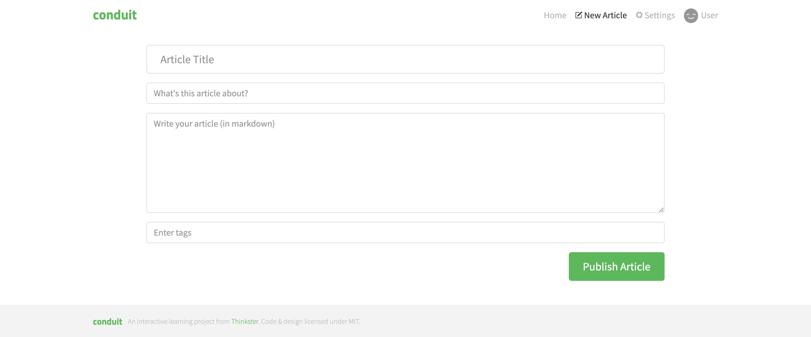
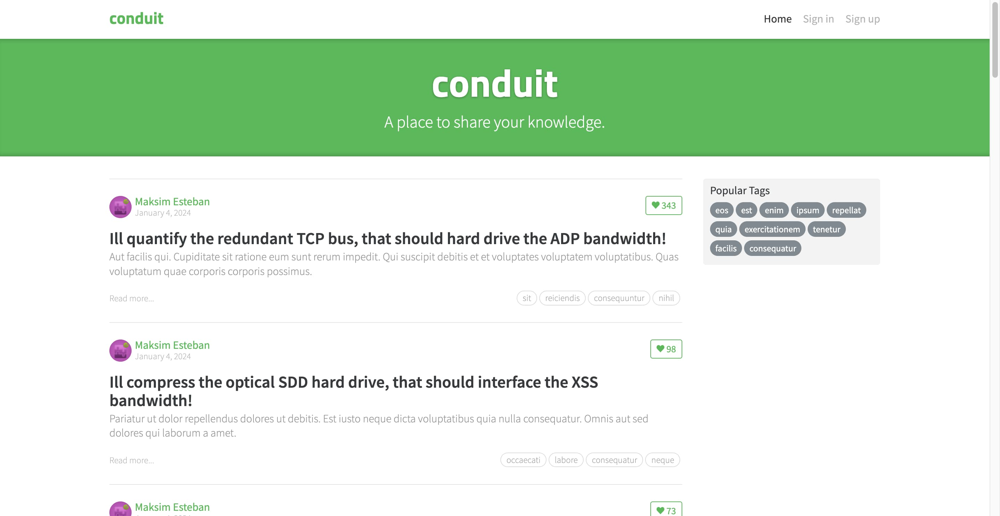
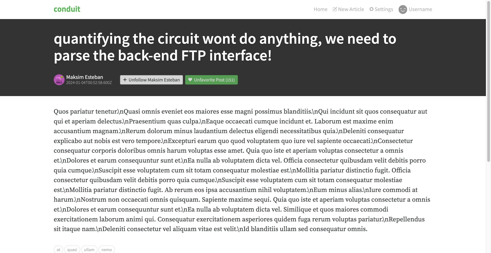
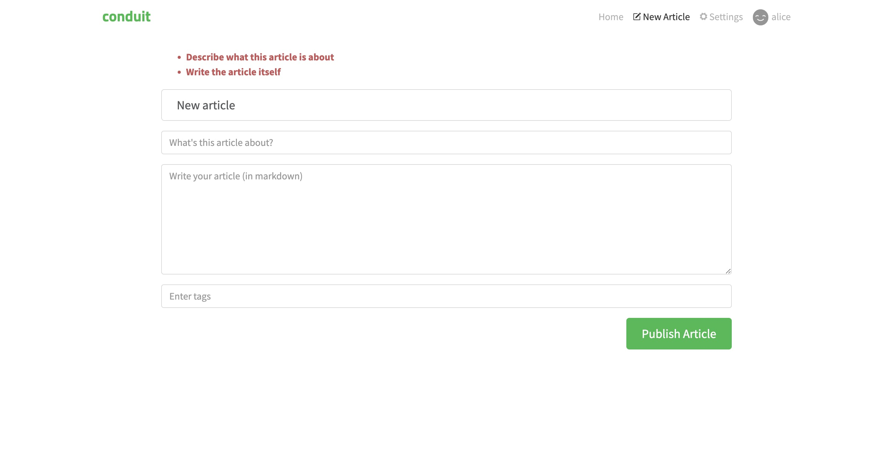

import { FileTree, Code } from '@astrojs/starlight/components';

## Bölüm 1. Kağıt üzerinde

Bu eğitimde Conduit olarak da bilinen Real World App incelenecektir. Conduit temel bir [Medium](https://medium.com/) klonudur — makaleler okuyup yazmanıza, ayrıca başkalarının makalelerine yorum yapmanıza olanak tanır.



Bu oldukça küçük bir uygulama, bu yüzden basit tutacağız ve aşırı ayrıştırmadan (decomposition) kaçınacağız. Uygulamanın tamamının sadece üç katmana sığması kuvvetle muhtemeldir: **App**, **Pages**, ve **Shared**. Eğer sığmazsa, ilerledikçe ek katmanlar dahil edeceğiz. Hazır mısınız?

### Sayfaları listeleyerek başlayalım

Yukarıdaki ekran görüntüsüne bakarsak, en azından aşağıdaki sayfaların olduğunu varsayabiliriz:

- Ana sayfa (makale akışı)
- Giriş yap ve kayıt ol
- Makale okuyucu
- Makale düzenleyici
- Kullanıcı profili görüntüleyicisi
- Kullanıcı profili düzenleyicisi (kullanıcı ayarları)

Bu sayfaların her biri Pages *katmanında (layer)* kendi *dilimi (slice)* haline gelecektir. Genel bakış bölümünden hatırlayacağınız üzere dilimler (slices) sadece katmanların içindeki klasörlerdir ve katmanlar (layers) da `pages` gibi önceden tanımlanmış isimlere sahip klasörlerdir.

Buna göre, Pages klasörümüz şu şekilde görünecektir:

<FileTree>
- pages/
  - feed/ #akış sayfası
  - sign-in/ #kayıt ol sayfası
  - article-read/ #makale okuma sayfası
  - article-edit/ #makale yazma/güncelleme sayfası
  - profile/ #kullanıcı profili görüntüleme sayfası
  - settings/ #kullanıcı ayarları sayfası
</FileTree>

Feature-Sliced Design'ın kuralsız bir kod yapısından en önemli farkı, sayfaların birbirine referans verememesidir. Yani, bir sayfa diğer bir sayfadan kod içe aktaramaz (import edemez). Bunun sebebi **katmanlardaki içe aktarma kuralıdır (import rule on layers)**:

*Bir dilim (slice) içindeki bir modül (dosya), sadece kesinlikle daha alt katmanlarda bulunduklarında diğer dilimleri içe aktarabilir.*

Bu durumda, bir sayfa bir dilimdir, dolayısıyla bu sayfanın içindeki modüller (dosyalar) aynı katmandan, yani Pages'den değil, yalnızca alt katmanlardaki kodlara referans verebilir.

### Akışa (feed) yakından bakış

<figure>
  
  <figcaption>
    _Anonim kullanıcı görünümü_
  </figcaption>
</figure>

<figure>
  
  <figcaption>
    _Giriş yapmış kullanıcı görünümü_
  </figcaption>
</figure>

Akış sayfasında üç dinamik alan bulunmaktadır:

1. Giriş yapıp yapmadığınızı belirten giriş (sign-in) bağlantıları
2. Akışta filtrelemeyi tetikleyen etiket (tag) listesi
3. Bir veya iki makale akışı, her makalede bir beğen (like) butonu

Giriş bağlantıları, tüm sayfalarda ortak olan bir başlığın (header) parçasıdır, buna daha sonra ayrıca döneceğiz.

#### Etiket listesi

Etiket listesini oluşturmak için kullanılabilir etiketleri getirmeli, her etiketi bir etiket (chip) olarak görselleştirmeli ve seçili etiketleri istemci tarafı bellekte (client-side storage) tutmalıyız. Bu işlemler sırasıyla “API etkileşimi”, “kullanıcı arayüzü” ve “depolama” kategorilerine girer. Feature-Sliced Design'da kod, *segmentler* kullanılarak amaca göre ayrıştırılır. Segmentler, dilimler içindeki klasörlerdir ve amaca göre tanımlanabilecek rastgele isimlere sahip olabilir, ancak bazı amaçlar o kadar yaygındır ki belirli segment isimleri için kurallar vardır:

- 📂 `api/` — arka uç etkileşimleri için
- 📂 `ui/` — görselleştirme (rendering) ve görünüme dair kodlar için
- 📂 `model/` — veri depolama (storage) ve iş mantığı için
- 📂 `config/` — özellik bayrakları (feature flags), ortam değişkenleri ve diğer yapılandırma türleri için

Etiketleri getiren kodu `api` segmentine, etiket bileşenini `ui` segmentine ve depolama etkileşimini `model` segmentine yerleştireceğiz.

#### Makaleler

Aynı gruplandırma prensiplerini kullanarak, makale akışını da benzer şekilde üç segmente ayrıştırabiliriz:

- 📂 `api/`: sayfalandırılmış (paginated) makaleleri beğeni sayısıyla birlikte getirme; bir makaleyi beğenme
- 📂 `ui/`:
    - bir etiket seçildiğinde ekstra bir sekme gösterebilen sekme listesi
    - tekil makale
    - fonksiyonuna göre sayfalandırma
- 📂 `model/`: halihazırda yüklenmiş makalelerin ve mevcut sayfanın (gerekirse) istemci tarafında depolanması (client-side storage)

### Ortak kodları tekrar kullanmak

Çoğu sayfa amaç olarak birbirinden oldukça farklıdır, ancak uygulamanın genelinde aynı kalan bazı şeyler vardır — örneğin, tasarım diline uygun bir UI kiti veya arka uçta her şeyin aynı kimlik doğrulama yöntemine sahip bir REST API ile yapıldığı kuralı. Dilimler (slices) izole edilmek üzere tasarlandığından, kod tekrar kullanımı daha alt bir katman olan **Shared** katmanı aracılığıyla sağlanır.

Shared, diğer katmanlardan farklı olarak dilimler değil, segmentler içerir. Bu açıdan, Shared katmanı katman ile dilim arasında hibrit bir yapı olarak düşünülebilir.

Genellikle Shared içindeki kod, önceden planlanmaz; geliştirme sırasında çıkarılır çünkü ancak o zaman hangi kodların gerçekten paylaşıldığı netleşir. Ancak yine de aklınızda tutmakta fayda var: 

- 📂 `ui/` — UI kiti, salt görünüm, iş mantığı (business logic) içermez. Örneğin; butonlar, modal iletişim kutuları, form girdileri.
- 📂 `api/` — istek yapma ilkelleri (Web'deki `fetch()` gibi) etrafında kolaylaştırıcı sarmalayıcılar (wrappers) ve isteğe bağlı olarak, arka uç belirtimlerine göre belirli istekleri tetikleyen fonksiyonlar.
- 📂 `config/` — ortam değişkenlerini çözümleme
- 📂 `i18n/` — dil desteğinin yapılandırılması
- 📂 `router/` — yönlendirme ilkelleri (routing primitives) ve rota sabitleri (route constants)

Bunlar Shared içindeki segment adlarına sadece birkaç örnektir, herhangi birini çıkarabilir veya kendinizinkini oluşturabilirsiniz. Yeni segmentler oluştururken hatırlamanız gereken tek önemli nokta, segment adlarının **özü (ne olduğunu) değil, amacı (neden olduğunu)** açıklaması gerektiğidir. “components”, “hooks”, “modals” gibi isimler *kullanılmamalıdır* çünkü bu dosyaların ne olduğunu açıklarlar, ancak içerideki koda göz atmaya (navigate) yardımcı olmazlar. Bu tür isimlendirmeler, ekipteki kişilerin bu tür klasörlerdeki her dosyayı tek tek incelemesini gerektirir ve ayrıca alakasız kodları bir arada tutar; bu da yeniden düzenlemenin (refactoring) çok geniş kod alanlarını etkilemesine yol açarak kod incelemesini ve test sürecini zorlaştırır.

### Kesin bir public API tanımlayın

Feature-Sliced Design bağlamında *public API* terimi, projedeki diğer modüller tarafından kendisinden nelerin içe aktarılabileceğini beyan eden bir dilim (slice) veya segmenti ifade eder. Örneğin, JavaScript'te bu, dilim içindeki diğer dosyalardan gelen nesneleri yeniden dışa aktaran (re-export) bir `index.js` dosyası olabilir. Dış dünyayla olan sözleşme (yani public API) aynı kaldığı sürece bu, bir dilimin içindeki kodu yeniden düzenleme konusunda özgürlük sağlar.

Dilim barındırmayan Shared katmanı için, Shared içindeki her şey için tek bir indeks tanımlamak yerine her bir segment için ayrı bir public API tanımlamak genellikle daha uygundur. Bu yaklaşım, Shared'dan yapılan içe aktarmaların amaca göre doğal bir şekilde organize olmasını sağlar. Dilimleri olan diğer katmanlar içinse bunun tam tersi geçerlidir — genellikle her dilim için tek bir indeks tanımlamak ve dış dünya tarafından bilinmeyen kendi segment kümesini belirlemeyi dilimin kendisine bırakmak daha pratiktir, çünkü diğer katmanların genellikle çok daha az dışa aktarımı vardır.

Dilimlerimiz/segmentlerimiz birbirlerine şu şekilde görünecektir:

<FileTree>
- pages/
  - feed/
    - index
  - sign-in/
    - index
  - article-read/
    - index
  - ...
- shared/
  - ui/
    - index
  - api/
    - index
  - ...
</FileTree>

`pages/feed` veya `shared/ui` gibi klasörlerin içinde ne olduğu yalnızca bu klasörler tarafından bilinir ve diğer dosyalar bu klasörlerin iç yapısına bağımlı olmamalıdır.

### UI'daki yeniden kullanılan büyük bloklar

Daha önce, her sayfada yer alan başlığa (header) ileride tekrar değineceğimizi not etmiştik. Onu her sayfada sıfırdan oluşturmak pratik olmazdı, bu nedenle yeniden kullanmak istememiz son derece doğaldır. Kodun yeniden kullanımını kolaylaştırmak için halihazırda Shared katmanımız var, ancak büyük UI bloklarını Shared içine koyarken dikkat edilmesi gereken bir nokta vardır — Shared katmanının, kendi üstündeki katmanların hiçbirini bilmemesi gerekir.

Shared ile Pages arasında üç katman daha bulunur: Entities, Features ve Widgets. Bazı projelerin bu katmanlardaki bazı yapılara büyük ve yeniden kullanılabilir bir blok içinde ihtiyacı olabilir; bu da söz konusu yeniden kullanılabilir bloğu Shared içine koyamayacağımız anlamına gelir, aksi takdirde yasaklı bir eylem olan 'üst katmanlardan içe aktarma yapma (importing from upper layers)' kuralını çiğnemiş oluruz. İşte Widgets katmanı burada devreye girer. Shared, Entities ve Features katmanlarının yukarısında yer aldığı için hepsini kullanabilir.

Bizim durumumuzda, başlık oldukça basittir — statik bir logo ve üst düzey bir gezinme (navigation) menüsünden oluşur. Gezinme menüsünün, kullanıcının o an giriş yapıp yapmadığını belirlemek için API'ye bir istekte bulunması gerekir; fakat bu işlem, `api` segmentinden basit bir içe aktarmayla halledilebilir. Bu nedenle, başlığımızı Shared katmanında tutacağız.

### Form içeren bir sayfaya yakından bakış

Okuma değil, düzenleme amacıyla tasarlanmış bir sayfayı da inceleyelim. Örneğin, makale yazma sayfası (article writer):



Görünüşte basit gibi dursa da uygulama geliştirmenin henüz değinmediğimiz birkaç yönünü barındırır — form doğrulama (validation), hata durumları (error states) ve veri kalıcılığı (data persistence).

Bu sayfayı bizim yapmamız gerekseydi, Shared içerisinden bazı girdileri (inputs) ve butonları alır, bu sayfanın `ui` segmentinde bir form olarak bir araya getirirdik. Ardından, `api` segmentinde makaleyi arka uçta oluşturmak için bir mutasyon (mutation) isteği tanımlardık.

İsteği göndermeden önce doğrulamak için bir doğrulama şemasına (validation schema) ihtiyacımız vardır ve veri modeli olduğu için bunun en uygun yeri `model` segmentidir. Orada hata mesajlarını üretecek ve bunları `ui` segmentindeki başka bir bileşen kullanarak görüntüleyeceğiz.

Kullanıcı deneyimini iyileştirmek adına, yanlışlıkla yaşanabilecek veri kayıplarını önlemek için girdileri (inputs) kalıcı hale de getirebiliriz (persist). Bu da yine `model` segmentinin bir görevidir.

### Özet

Birkaç sayfayı inceledik ve uygulamamız için bir ön yapı taslağı çıkardık:

1. Shared katmanı
    1. `ui` yeniden kullanılabilir UI kitimizi içerecek
    2. `api` arka uç ile olan temel (primitive) etkileşimlerimizi içerecek
    3. Geri kalanı ihtiyaca göre düzenlenecek
2. Pages katmanı — her sayfa ayrı bir dilimdir (slice)
    1. `ui` sayfanın kendisini ve tüm parçalarını içerecek
    2. `api` `shared/api` kullanarak daha özelleştirilmiş veri getirme işlemlerini içerecek
    3. `model` görüntüleyeceğimiz verilerin istemci tarafı belleğini (client-side storage) barındırabilir

Hadi geliştirmeye başlayalım!

## Bölüm 2. Kod üzerinde

Artık bir planımız olduğuna göre, bunu pratiğe dökelim. React ve [Remix](https://remix.run) kullanacağız.

Bu proje için hazır bir şablon mevcut, hızlı bir başlangıç yapmak için GitHub'dan klonlayın: [https://github.com/feature-sliced/tutorial-conduit/tree/clean](https://github.com/feature-sliced/tutorial-conduit/tree/clean).

Bağımlılıkları (dependencies) `npm install` ile kurun ve geliştirme sunucusunu (development server) `npm run dev` ile başlatın. `http://localhost:3000` adresini açtığınızda boş bir uygulama görmelisiniz.

### Sayfaların yapısını oluşturma

Tüm sayfalarımız için boş bileşenler (components) oluşturarak başlayalım. Projenizde aşağıdaki komutu çalıştırın:

```bash
npx fsd pages feed sign-in article-read article-edit profile settings --segments ui
```

Bu komut, her sayfa için `pages/feed/ui/` benzeri klasörler ve `pages/feed/index.ts` gibi bir indeks dosyası oluşturacaktır.

### Akış (feed) sayfasını bağlama

Uygulamamızın kök rotasını (root route) akış sayfasına bağlayalım. `pages/feed/ui` dizininde `FeedPage.tsx` adında bir bileşen oluşturun ve içine aşağıdakileri koyun:


```tsx title="pages/feed/ui/FeedPage.tsx"
export function FeedPage() {
  return (
    <div className="home-page">
      <div className="banner">
        <div className="container">
          <h1 className="logo-font">conduit</h1>
          <p>A place to share your knowledge.</p>
        </div>
      </div>
    </div>
  );
}
```

Sonra bu bileşeni akış sayfasının public API'sinde, yani `pages/feed/index.ts` dosyasında yeniden dışa aktarın (re-export):


```ts title="pages/feed/index.ts"
export { FeedPage } from "./ui/FeedPage";
```

Şimdi bunu kök rotaya (root route) bağlayın. Remix'te yönlendirme (routing) dosya tabanlıdır ve rota dosyaları `app/routes` klasöründe bulunur; bu da Feature-Sliced Design ile oldukça güzel bir şekilde örtüşür.

`app/routes/_index.tsx` dosyasında `FeedPage` bileşenini kullanın:

```tsx title="app/routes/_index.tsx"
import type { MetaFunction } from "@remix-run/node";
import { FeedPage } from "pages/feed";

export const meta: MetaFunction = () => {
  return [{ title: "Conduit" }];
};

export default FeedPage;
```

Ardından, geliştirme sunucusunu (dev server) çalıştırır ve uygulamayı açarsanız Conduit afişini (banner) görmelisiniz!


### API istemcisi (API client)

RealWorld arka ucuyla (backend) konuşmak için Shared katmanında kullanışlı bir API istemcisi oluşturalım. İstemci için `api` ve arka uç temel URL'si (base URL) gibi değişkenler için `config` olmak üzere iki segment oluşturun:

```bash
npx fsd shared --segments api config
```

Ardından `shared/config/backend.ts` dosyasını oluşturun:

```tsx title="shared/config/backend.ts"
export { mockBackendUrl as backendBaseUrl } from "mocks/handlers";
```

```tsx title="shared/config/index.ts"
export { backendBaseUrl } from "./backend";
```

RealWorld projesi kullanışlı bir şekilde bir [OpenAPI spesifikasyonu](https://github.com/gothinkster/realworld/blob/main/api/openapi.yml) sunduğu için, istemcimiz için otomatik oluşturulan (auto-generated) tiplerden faydalanabiliriz. Ek bir tip oluşturucu (type generator) ile birlikte gelen [`openapi-fetch` paketini](https://openapi-ts.pages.dev/openapi-fetch/) kullanacağız.

Güncel API tiplerini (typings) oluşturmak için aşağıdaki komutu çalıştırın:

```bash
npm run generate-api-types
```

Bu komut, `shared/api/v1.d.ts` dosyasını oluşturacaktır. Bu dosyayı `shared/api/client.ts` içinde tiplendirilmiş (typed) bir API istemcisi oluşturmak için kullanacağız:

```tsx title="shared/api/client.ts"
import createClient from "openapi-fetch";

import { backendBaseUrl } from "shared/config";
import type { paths } from "./v1";

export const { GET, POST, PUT, DELETE } = createClient<paths>({ baseUrl: backendBaseUrl });
```

```tsx title="shared/api/index.ts"
export { GET, POST, PUT, DELETE } from "./client";
```

### Akışta (feed) gerçek veriler

Artık arka uçtan (backend) getirilen makaleleri akışa eklemeye geçebiliriz. Bir makale önizleme (article preview) bileşeni uygulayarak başlayalım.

Aşağıdaki içerikle `pages/feed/ui/ArticlePreview.tsx` dosyasını oluşturun:

```tsx title="pages/feed/ui/ArticlePreview.tsx"
export function ArticlePreview({ article }) { /* TODO */ }
```

TypeScript ile yazdığımız için tiplendirilmiş (typed) bir makale nesnesine sahip olmak güzel olurdu. Oluşturulan `v1.d.ts` dosyasını incelersek, makale nesnesine `components["schemas"]["Article"]` aracılığıyla ulaşılabileceğini görebiliriz. O halde Shared katmanında veri modellerimizle bir dosya oluşturalım ve bu modelleri dışa aktaralım (export):

```tsx title="shared/api/models.ts"
import type { components } from "./v1";

export type Article = components["schemas"]["Article"];
```

```tsx title="shared/api/index.ts"
export { GET, POST, PUT, DELETE } from "./client";

export type { Article } from "./models";
```

Şimdi makale önizleme bileşenine geri dönebilir ve yapıyı (markup) verilerle doldurabiliriz. Bileşeni aşağıdaki içerikle güncelleyin:

```tsx title="pages/feed/ui/ArticlePreview.tsx"
import { Link } from "@remix-run/react";
import type { Article } from "shared/api";

interface ArticlePreviewProps {
  article: Article;
}

export function ArticlePreview({ article }: ArticlePreviewProps) {
  return (
    <div className="article-preview">
      <div className="article-meta">
        <Link to={`/profile/${article.author.username}`} prefetch="intent">
          
        </Link>
        <div className="info">
          <Link
            to={`/profile/${article.author.username}`}
            className="author"
            prefetch="intent"
          >
            {article.author.username}
          </Link>
          <span className="date" suppressHydrationWarning>
            {new Date(article.createdAt).toLocaleDateString(undefined, {
              dateStyle: "long",
            })}
          </span>
        </div>
        <button className="btn btn-outline-primary btn-sm pull-xs-right">
          <i className="ion-heart"></i> {article.favoritesCount}
        </button>
      </div>
      <Link
        to={`/article/${article.slug}`}
        className="preview-link"
        prefetch="intent"
      >
        <h1>{article.title}</h1>
        <p>{article.description}</p>
        <span>Read more...</span>
        <ul className="tag-list">
          {article.tagList.map((tag) => (
            <li key={tag} className="tag-default tag-pill tag-outline">
              {tag}
            </li>
          ))}
        </ul>
      </Link>
    </div>
  );
}
```

Beğenme (like) butonu şimdilik hiçbir şey yapmıyor; makale okuma sayfasına (article reader) geçtiğimizde ve beğenme işlevini uyguladığımızda bunu düzelteceğiz.

Artık makaleleri getirebilir (fetch) ve bu kartlardan birkaçını ekrana çizebiliriz (render). Remix'te veri getirme işlemi *yükleyiciler (loaders)* — bir sayfanın tam olarak neye ihtiyacı varsa onu getiren sunucu tarafı işlevleri — ile yapılır. Yükleyiciler sayfa adına API ile etkileşime girer, bu yüzden onları bir sayfanın `api` segmentine yerleştireceğiz:

```tsx title="pages/feed/api/loader.ts"
import { json } from "@remix-run/node";

import { GET } from "shared/api";

export const loader = async () => {
  const { data: articles, error, response } = await GET("/articles");

  if (error !== undefined) {
    throw json(error, { status: response.status });
  }

  return json({ articles });
};
```

Bunu sayfaya bağlamak için, rota (route) dosyasından `loader` adıyla dışa aktarmamız (export) gerekir:

```tsx title="pages/feed/index.ts"
export { FeedPage } from "./ui/FeedPage";
export { loader } from "./api/loader";
```

```tsx title="app/routes/_index.tsx"
import type { MetaFunction } from "@remix-run/node";
import { FeedPage } from "pages/feed";

export { loader } from "pages/feed";

export const meta: MetaFunction = () => {
  return [{ title: "Conduit" }];
};

export default FeedPage;
```

Ve son adım, bu kartları akış (feed) içinde oluşturmaktır (render). `FeedPage` bileşeninizi aşağıdaki kodla güncelleyin:

```tsx title="pages/feed/ui/FeedPage.tsx"
import { useLoaderData } from "@remix-run/react";

import type { loader } from "../api/loader";
import { ArticlePreview } from "./ArticlePreview";

export function FeedPage() {
  const { articles } = useLoaderData<typeof loader>();

  return (
    <div className="home-page">
      <div className="banner">
        <div className="container">
          <h1 className="logo-font">conduit</h1>
          <p>A place to share your knowledge.</p>
        </div>
      </div>

      <div className="container page">
        <div className="row">
          <div className="col-md-9">
            {articles.articles.map((article) => (
              <ArticlePreview key={article.slug} article={article} />
            ))}
          </div>
        </div>
      </div>
    </div>
  );
}
```

### Etikete göre filtreleme

Etiketler konusundaki görevimiz, onları arka uçtan (backend) getirmek ve halihazırda seçili olan etiketi saklamaktır. Veri getirme işlemini zaten biliyoruz — loader (yükleyici) aracılığıyla yapılan bir başka istektir. Önceden yüklenmiş olan `remix-utils` paketinden `promiseHash` adlı kullanışlı bir fonksiyonu kullanacağız.

`pages/feed/api/loader.ts` içerisindeki loader dosyasını aşağıdaki kodla güncelleyin:

```tsx title="pages/feed/api/loader.ts"
import { json } from "@remix-run/node";
import type { FetchResponse } from "openapi-fetch";
import { promiseHash } from "remix-utils/promise";

import { GET } from "shared/api";

async function throwAnyErrors<T, O, Media extends `${string}/${string}`>(
  responsePromise: Promise<FetchResponse<T, O, Media>>,
) {
  const { data, error, response } = await responsePromise;

  if (error !== undefined) {
    throw json(error, { status: response.status });
  }

  return data as NonNullable<typeof data>;
}

export const loader = async () => {
  return json(
    await promiseHash({
      articles: throwAnyErrors(GET("/articles")),
      tags: throwAnyErrors(GET("/tags")),
    }),
  );
};
```

Hata yakalama/işleme (error handling) sürecini `throwAnyErrors` isimli jenerik (generic) bir fonksiyona çıkardığımızı fark edebilirsiniz. Oldukça faydalı görünüyor, bu nedenle ileride yeniden kullanmak isteyebiliriz; ancak şimdilik aklımızın bir köşesinde bulunması yeterli.

Şimdi, etiket (tag) listesine gelelim. İnteraktif olması gerekir — bir etikete tıklandığında o etiket seçili hale gelmelidir. Remix geleneklerine (convention) uygun olarak, seçili etiket için depolama (storage) alanı olarak URL arama parametrelerini (search parameters) kullanacağız. Biz daha önemli işlere odaklanırken depolama işini tarayıcının (browser) halletmesine izin verelim.

`pages/feed/ui/FeedPage.tsx` dosyasını aşağıdaki kodla güncelleyin:

```tsx title="pages/feed/ui/FeedPage.tsx"
import { Form, useLoaderData } from "@remix-run/react";
import { ExistingSearchParams } from "remix-utils/existing-search-params";

import type { loader } from "../api/loader";
import { ArticlePreview } from "./ArticlePreview";

export function FeedPage() {
  const { articles, tags } = useLoaderData<typeof loader>();

  return (
    <div className="home-page">
      <div className="banner">
        <div className="container">
          <h1 className="logo-font">conduit</h1>
          <p>A place to share your knowledge.</p>
        </div>
      </div>

      <div className="container page">
        <div className="row">
          <div className="col-md-9">
            {articles.articles.map((article) => (
              <ArticlePreview key={article.slug} article={article} />
            ))}
          </div>

          <div className="col-md-3">
            <div className="sidebar">
              <p>Popular Tags</p>

              <Form>
                <ExistingSearchParams exclude={["tag"]} />
                <div className="tag-list">
                  {tags.tags.map((tag) => (
                    <button
                      key={tag}
                      name="tag"
                      value={tag}
                      className="tag-pill tag-default"
                    >
                      {tag}
                    </button>
                  ))}
                </div>
              </Form>
            </div>
          </div>
        </div>
      </div>
    </div>
  );
}
```

Daha sonra loader'ımızda `tag` arama parametresini kullanmamız gerekir. `pages/feed/api/loader.ts` içerisindeki `loader` fonksiyonunu şu şekilde değiştirin:

```tsx title="pages/feed/api/loader.ts"
import { json, type LoaderFunctionArgs } from "@remix-run/node";
import type { FetchResponse } from "openapi-fetch";
import { promiseHash } from "remix-utils/promise";

import { GET } from "shared/api";

async function throwAnyErrors<T, O, Media extends `${string}/${string}`>(
  responsePromise: Promise<FetchResponse<T, O, Media>>,
) {
  const { data, error, response } = await responsePromise;

  if (error !== undefined) {
    throw json(error, { status: response.status });
  }

  return data as NonNullable<typeof data>;
}

export const loader = async ({ request }: LoaderFunctionArgs) => {
  const url = new URL(request.url);
  const selectedTag = url.searchParams.get("tag") ?? undefined;

  return json(
    await promiseHash({
      articles: throwAnyErrors(
        GET("/articles", { params: { query: { tag: selectedTag } } }),
      ),
      tags: throwAnyErrors(GET("/tags")),
    }),
  );
};
```

İşte bu kadar, hiçbir `model` segmentine ihtiyaç kalmadı. Remix oldukça harika.

### Sayfalama (Pagination)

Benzer şekilde sayfalama (pagination) işlemini uygulayabiliriz. İsterseniz kendiniz deneyebilirsiniz veya sadece aşağıdaki kodu kopyalayabilirsiniz. Zaten kimse sizi yargılamayacak.

```tsx title="pages/feed/api/loader.ts"
import { json, type LoaderFunctionArgs } from "@remix-run/node";
import type { FetchResponse } from "openapi-fetch";
import { promiseHash } from "remix-utils/promise";

import { GET } from "shared/api";

async function throwAnyErrors<T, O, Media extends `${string}/${string}`>(
  responsePromise: Promise<FetchResponse<T, O, Media>>,
) {
  const { data, error, response } = await responsePromise;

  if (error !== undefined) {
    throw json(error, { status: response.status });
  }

  return data as NonNullable<typeof data>;
}

/** Bir sayfadaki makale sayısı. */
export const LIMIT = 20;

export const loader = async ({ request }: LoaderFunctionArgs) => {
  const url = new URL(request.url);
  const selectedTag = url.searchParams.get("tag") ?? undefined;
  const page = parseInt(url.searchParams.get("page") ?? "", 10);

  return json(
    await promiseHash({
      articles: throwAnyErrors(
        GET("/articles", {
          params: {
            query: {
              tag: selectedTag,
              limit: LIMIT,
              offset: !Number.isNaN(page) ? page * LIMIT : undefined,
            },
          },
        }),
      ),
      tags: throwAnyErrors(GET("/tags")),
    }),
  );
};
```

```tsx title="pages/feed/ui/FeedPage.tsx"
import { Form, useLoaderData, useSearchParams } from "@remix-run/react";
import { ExistingSearchParams } from "remix-utils/existing-search-params";

import { LIMIT, type loader } from "../api/loader";
import { ArticlePreview } from "./ArticlePreview";

export function FeedPage() {
  const [searchParams] = useSearchParams();
  const { articles, tags } = useLoaderData<typeof loader>();
  const pageAmount = Math.ceil(articles.articlesCount / LIMIT);
  const currentPage = parseInt(searchParams.get("page") ?? "1", 10);

  return (
    <div className="home-page">
      <div className="banner">
        <div className="container">
          <h1 className="logo-font">conduit</h1>
          <p>A place to share your knowledge.</p>
        </div>
      </div>

      <div className="container page">
        <div className="row">
          <div className="col-md-9">
            {articles.articles.map((article) => (
              <ArticlePreview key={article.slug} article={article} />
            ))}

            <Form>
              <ExistingSearchParams exclude={["page"]} />
              <ul className="pagination">
                {Array(pageAmount)
                  .fill(null)
                  .map((_, index) =>
                    index + 1 === currentPage ? (
                      <li key={index} className="page-item active">
                        <span className="page-link">{index + 1}</span>
                      </li>
                    ) : (
                      <li key={index} className="page-item">
                        <button
                          className="page-link"
                          name="page"
                          value={index + 1}
                        >
                          {index + 1}
                        </button>
                      </li>
                    ),
                  )}
              </ul>
            </Form>
          </div>

          <div className="col-md-3">
            <div className="sidebar">
              <p>Popular Tags</p>

              <Form>
                <ExistingSearchParams exclude={["tag", "page"]} />
                <div className="tag-list">
                  {tags.tags.map((tag) => (
                    <button
                      key={tag}
                      name="tag"
                      value={tag}
                      className="tag-pill tag-default"
                    >
                      {tag}
                    </button>
                  ))}
                </div>
              </Form>
            </div>
          </div>
        </div>
      </div>
    </div>
  );
}
```

Böylece bunu da tamamladık. Benzer şekilde eklenebilecek sekme listesi (tab list) de mevcut ancak kimlik doğrulama (authentication) aşamasına kadar bunu beklemeye alalım. Yeri gelmişken ondan da bahsedelim!

### Kimlik Doğrulama (Authentication)

Kimlik doğrulama iki sayfayı kapsar — biri giriş (login), diğeri ise kayıt (register) içindir. Bunlar çoğunlukla aynıdır; bu nedenle gerektiğinde kodu yeniden kullanabilmeleri için ikisini aynı dilimde (slice) —yani `sign-in` diliminde— tutmak mantıklıdır.

Aşağıdaki içerikle `pages/sign-in` konumunun `ui` segmentinde `RegisterPage.tsx` dosyasını oluşturun:

```tsx title="pages/sign-in/ui/RegisterPage.tsx"
import { Form, Link, useActionData } from "@remix-run/react";

import type { register } from "../api/register";

export function RegisterPage() {
  const registerData = useActionData<typeof register>();

  return (
    <div className="auth-page">
      <div className="container page">
        <div className="row">
          <div className="col-md-6 offset-md-3 col-xs-12">
            <h1 className="text-xs-center">Sign up</h1>
            <p className="text-xs-center">
              <Link to="/login">Have an account?</Link>
            </p>

            {registerData?.error && (
              <ul className="error-messages">
                {registerData.error.errors.body.map((error) => (
                  <li key={error}>{error}</li>
                ))}
              </ul>
            )}

            <Form method="post">
              <fieldset className="form-group">
                <input
                  className="form-control form-control-lg"
                  type="text"
                  name="username"
                  placeholder="Username"
                />
              </fieldset>
              <fieldset className="form-group">
                <input
                  className="form-control form-control-lg"
                  type="text"
                  name="email"
                  placeholder="Email"
                />
              </fieldset>
              <fieldset className="form-group">
                <input
                  className="form-control form-control-lg"
                  type="password"
                  name="password"
                  placeholder="Password"
                />
              </fieldset>
              <button className="btn btn-lg btn-primary pull-xs-right">
                Sign up
              </button>
            </Form>
          </div>
        </div>
      </div>
    </div>
  );
}
```

Şimdi düzeltmemiz gereken hatalı (kırık) bir import'umuz var. Bu, yeni bir segment oluşturmayı gerektiriyor, o halde oluşturalım:

```bash
npx fsd pages sign-in -s api
```

Ancak kayıt olma (register) işleminin arka uç (backend) kısmını uygulamadan önce, Remix'in oturumları (sessions) idare etmesi için altyapı kodlarına ihtiyacımız var. Bu kod, başka sayfaların da ihtiyacı olabileceği ihtimaline karşı Shared katmanına gider.

Aşağıdaki kodu `shared/api/auth.server.ts` içerisine koyun. Bu kod büyük oranda Remix'e özgüdür, bu yüzden çok fazla kafa yormanıza gerek yok, sadece kopyalayıp yapıştırın:

```tsx title="shared/api/auth.server.ts"
import { createCookieSessionStorage, redirect } from "@remix-run/node";
import invariant from "tiny-invariant";

import type { User } from "./models";

invariant(
  process.env.SESSION_SECRET,
  "SESSION_SECRET must be set for authentication to work",
);

const sessionStorage = createCookieSessionStorage<{
  user: User;
}>({
  cookie: {
    name: "__session",
    httpOnly: true,
    path: "/",
    sameSite: "lax",
    secrets: [process.env.SESSION_SECRET],
    secure: process.env.NODE_ENV === "production",
  },
});

export async function createUserSession({
  request,
  user,
  redirectTo,
}: {
  request: Request;
  user: User;
  redirectTo: string;
}) {
  const cookie = request.headers.get("Cookie");
  const session = await sessionStorage.getSession(cookie);

  session.set("user", user);

  return redirect(redirectTo, {
    headers: {
      "Set-Cookie": await sessionStorage.commitSession(session, {
        maxAge: 60 * 60 * 24 * 7, // 7 gün
      }),
    },
  });
}

export async function getUserFromSession(request: Request) {
  const cookie = request.headers.get("Cookie");
  const session = await sessionStorage.getSession(cookie);

  return session.get("user") ?? null;
}

export async function requireUser(request: Request) {
  const user = await getUserFromSession(request);

  if (user === null) {
    throw redirect("/login");
  }

  return user;
}
```

Ayrıca, onun hemen yanındaki `models.ts` dosyasından `User` modelini dışa aktarın (export):

```tsx title="shared/api/models.ts"
import type { components } from "./v1";

export type Article = components["schemas"]["Article"];
export type User = components["schemas"]["User"];
```

Bu kodun çalışabilmesi için öncelikle `SESSION_SECRET` çevre değişkeninin (environment variable) ayarlanması gerekir. Projenin kök dizininde `.env` adında bir dosya oluşturun, `SESSION_SECRET=` yazın ve ardından klavyenizdeki tuşlara rastgele basarak uzun ve rastgele bir dize (string) oluşturun. Buna benzer bir şey elde etmelisiniz:

```bash title=".env"
SESSION_SECRET=dontyoudarecopypastethis
```

Son olarak, bu kodu kullanabilmek için public API'ye bazı dışa aktarmalar (exports) ekleyin:

```tsx title="shared/api/index.ts"
export { GET, POST, PUT, DELETE } from "./client";

export type { Article } from "./models";

export { createUserSession, getUserFromSession, requireUser } from "./auth.server";
```

Artık kaydı gerçekleştirmek için RealWorld arka ucu (backend) ile konuşacak olan kodu yazabiliriz. Bunu `pages/sign-in/api` içinde tutacağız. `register.ts` adında bir dosya oluşturun ve içine aşağıdaki kodu koyun:

```tsx title="pages/sign-in/api/register.ts"
import { json, type ActionFunctionArgs } from "@remix-run/node";

import { POST, createUserSession } from "shared/api";

export const register = async ({ request }: ActionFunctionArgs) => {
  const formData = await request.formData();
  const username = formData.get("username")?.toString() ?? "";
  const email = formData.get("email")?.toString() ?? "";
  const password = formData.get("password")?.toString() ?? "";

  const { data, error } = await POST("/users", {
    body: { user: { email, password, username } },
  });

  if (error) {
    return json({ error }, { status: 400 });
  } else {
    return createUserSession({
      request: request,
      user: data.user,
      redirectTo: "/",
    });
  }
};
```

```tsx title="pages/sign-in/index.ts"
export { RegisterPage } from './ui/RegisterPage';
export { register } from './api/register';
```

Neredeyse bitti! Sadece sayfayı ve eylemi (action) `/register` rotasına bağlamamız gerekiyor. `app/routes` içinde `register.tsx` oluşturun:

```tsx title="app/routes/register.tsx"
import { RegisterPage, register } from "pages/sign-in";

export { register as action };

export default RegisterPage;
```

Şimdi `http://localhost:3000/register` adresine giderseniz bir kullanıcı oluşturabilmelisiniz! Uygulamanın geri kalanı henüz buna tepki vermeyecek, birazdan bu konuya da değineceğiz.

Çok benzer bir şekilde, giriş (login) sayfasını da uygulayabiliriz. İsterseniz kendiniz deneyin ya da aşağıdaki kodu kopyalayıp devam edin:

```tsx title="pages/sign-in/api/sign-in.ts"
import { json, type ActionFunctionArgs } from "@remix-run/node";

import { POST, createUserSession } from "shared/api";

export const signIn = async ({ request }: ActionFunctionArgs) => {
  const formData = await request.formData();
  const email = formData.get("email")?.toString() ?? "";
  const password = formData.get("password")?.toString() ?? "";

  const { data, error } = await POST("/users/login", {
    body: { user: { email, password } },
  });

  if (error) {
    return json({ error }, { status: 400 });
  } else {
    return createUserSession({
      request: request,
      user: data.user,
      redirectTo: "/",
    });
  }
};
```

```tsx title="pages/sign-in/ui/SignInPage.tsx"
import { Form, Link, useActionData } from "@remix-run/react";

import type { signIn } from "../api/sign-in";

export function SignInPage() {
  const signInData = useActionData<typeof signIn>();

  return (
    <div className="auth-page">
      <div className="container page">
        <div className="row">
          <div className="col-md-6 offset-md-3 col-xs-12">
            <h1 className="text-xs-center">Sign in</h1>
            <p className="text-xs-center">
              <Link to="/register">Need an account?</Link>
            </p>

            {signInData?.error && (
              <ul className="error-messages">
                {signInData.error.errors.body.map((error) => (
                  <li key={error}>{error}</li>
                ))}
              </ul>
            )}

            <Form method="post">
              <fieldset className="form-group">
                <input
                  className="form-control form-control-lg"
                  name="email"
                  type="text"
                  placeholder="Email"
                />
              </fieldset>
              <fieldset className="form-group">
                <input
                  className="form-control form-control-lg"
                  name="password"
                  type="password"
                  placeholder="Password"
                />
              </fieldset>
              <button className="btn btn-lg btn-primary pull-xs-right">
                Sign in
              </button>
            </Form>
          </div>
        </div>
      </div>
    </div>
  );
}
```

```tsx title="pages/sign-in/index.ts"
export { RegisterPage } from './ui/RegisterPage';
export { register } from './api/register';
export { SignInPage } from './ui/SignInPage';
export { signIn } from './api/sign-in';
```

```tsx title="app/routes/login.tsx"
import { SignInPage, signIn } from "pages/sign-in";

export { signIn as action };

export default SignInPage;
```

Şimdi kullanıcılara bu sayfalara gerçekten ulaşabilmeleri için bir yol sunalım.

### Başlık (Header)

Bölüm 1'de bahsettiğimiz gibi, uygulama başlığı (header) genellikle ya Widgets ya da Shared katmanına yerleştirilir. Çok basit olduğu ve tüm iş mantığı (business logic) dışında tutulabileceği için onu Shared içine yerleştireceğiz. Onun için bir yer oluşturalım:

```bash
npx fsd shared ui
```

Şimdi aşağıdaki içerikle `shared/ui/Header.tsx` dosyasını oluşturun:

```tsx title="shared/ui/Header.tsx"
import { useContext } from "react";
import { Link, useLocation } from "@remix-run/react";

import { CurrentUser } from "../api/currentUser";

export function Header() {
  const currentUser = useContext(CurrentUser);
  const { pathname } = useLocation();

  return (
    <nav className="navbar navbar-light">
      <div className="container">
        <Link className="navbar-brand" to="/" prefetch="intent">
          conduit
        </Link>
        <ul className="nav navbar-nav pull-xs-right">
          <li className="nav-item">
            <Link
              prefetch="intent"
              className={`nav-link ${pathname == "/" ? "active" : ""}`}
              to="/"
            >
              Home
            </Link>
          </li>
          {currentUser == null ? (
            <>
              <li className="nav-item">
                <Link
                  prefetch="intent"
                  className={`nav-link ${pathname == "/login" ? "active" : ""}`}
                  to="/login"
                >
                  Sign in
                </Link>
              </li>
              <li className="nav-item">
                <Link
                  prefetch="intent"
                  className={`nav-link ${pathname == "/register" ? "active" : ""}`}
                  to="/register"
                >
                  Sign up
                </Link>
              </li>
            </>
          ) : (
            <>
              <li className="nav-item">
                <Link
                  prefetch="intent"
                  className={`nav-link ${pathname == "/editor" ? "active" : ""}`}
                  to="/editor"
                >
                  <i className="ion-compose"></i>&nbsp;New Article{" "}
                </Link>
              </li>

              <li className="nav-item">
                <Link
                  prefetch="intent"
                  className={`nav-link ${pathname == "/settings" ? "active" : ""}`}
                  to="/settings"
                >
                  {" "}
                  <i className="ion-gear-a"></i>&nbsp;Settings{" "}
                </Link>
              </li>
              <li className="nav-item">
                <Link
                  prefetch="intent"
                  className={`nav-link ${pathname.includes("/profile") ? "active" : ""}`}
                  to={`/profile/${currentUser.username}`}
                >
                  {currentUser.image && (
                    
                  )}
                  {currentUser.username}
                </Link>
              </li>
            </>
          )}
        </ul>
      </div>
    </nav>
  );
}
```

Bu bileşeni `shared/ui` içinden dışa aktarın (export):

```tsx title="shared/ui/index.ts"
export { Header } from "./Header";
```

Başlıkta, `shared/api` içinde tutulan bir bağlama (context) dayanıyoruz. Onu da oluşturun:

```tsx title="shared/api/currentUser.ts"
import { createContext } from "react";

import type { User } from "./models";

export const CurrentUser = createContext<User | null>(null);
```

```tsx title="shared/api/index.ts"
export { GET, POST, PUT, DELETE } from "./client";

export type { Article } from "./models";

export { createUserSession, getUserFromSession, requireUser } from "./auth.server";
export { CurrentUser } from "./currentUser";
```

Şimdi başlığı (header) sayfaya ekleyelim. Her sayfada yer almasını istediğimiz için, onu basitçe kök rotaya (root route) eklemek ve outlet'i (sayfanın render edileceği yer) `CurrentUser` context sağlayıcısı (provider) ile sarmalamak mantıklıdır. Bu şekilde hem tüm uygulamamız hem de başlığımız mevcut kullanıcı nesnesine erişebilir. Ayrıca mevcut kullanıcı nesnesini gerçekten çerezlerden (cookies) elde etmek için bir yükleyici (loader) ekleyeceğiz. Aşağıdakileri `app/root.tsx` dosyasına ekleyin:

```tsx title="app/root.tsx"
import { cssBundleHref } from "@remix-run/css-bundle";
import type { LinksFunction, LoaderFunctionArgs } from "@remix-run/node";
import {
  Links,
  LiveReload,
  Meta,
  Outlet,
  Scripts,
  ScrollRestoration,
  useLoaderData,
} from "@remix-run/react";

import { Header } from "shared/ui";
import { getUserFromSession, CurrentUser } from "shared/api";

export const links: LinksFunction = () => [
  ...(cssBundleHref ? [{ rel: "stylesheet", href: cssBundleHref }] : []),
];

export const loader = ({ request }: LoaderFunctionArgs) =>
  getUserFromSession(request);

export default function App() {
  const user = useLoaderData<typeof loader>();

  return (
    <html lang="en">
      <head>
        <meta charSet="utf-8" />
        <meta name="viewport" content="width=device-width, initial-scale=1" />
        <Meta />
        <Links />
        <link
          href="//code.ionicframework.com/ionicons/2.0.1/css/ionicons.min.css"
          rel="stylesheet"
          type="text/css"
        />
        <link
          href="//fonts.googleapis.com/css?family=Titillium+Web:700|Source+Serif+Pro:400,700|Merriweather+Sans:400,700|Source+Sans+Pro:400,300,600,700,300italic,400italic,600italic,700italic"
          rel="stylesheet"
          type="text/css"
        />
        <link rel="stylesheet" href="//demo.productionready.io/main.css" />
        <style>{`
          button {
            border: 0;
          }
        `}</style>
      </head>
      <body>
        <CurrentUser.Provider value={user}>
          <Header />
          <Outlet />
        </CurrentUser.Provider>
        <ScrollRestoration />
        <Scripts />
        <LiveReload />
      </body>
    </html>
  );
}
```

Bu noktada, ana sayfada (home page) aşağıdaki gibi bir sonuç elde etmelisiniz:

<figure>
  

  <figcaption>Başlık (header), akış (feed) ve etiketler (tags) dahil Conduit'in akış sayfası. Sekmeler (tabs) hala eksik.</figcaption>
</figure>

### Sekmeler (Tabs)

Artık kimlik doğrulama (authentication) durumunu algılayabildiğimize göre, akış (feed) sayfasıyla işimizi bitirmek adına sekmeleri (tabs) ve gönderi beğenilerini (post likes) hızlıca uygulayalım. Başka bir forma daha ihtiyacımız var, ancak bu sayfa dosyası fazla büyümeye başlıyor; bu yüzden bu formları yan dosyalara (adjacent files) taşıyalım. Aşağıdaki içerikle `Tabs.tsx`, `PopularTags.tsx` ve `Pagination.tsx` dosyalarını oluşturacağız:

```tsx title="pages/feed/ui/Tabs.tsx"
import { useContext } from "react";
import { Form, useSearchParams } from "@remix-run/react";

import { CurrentUser } from "shared/api";

export function Tabs() {
  const [searchParams] = useSearchParams();
  const currentUser = useContext(CurrentUser);

  return (
    <Form>
      <div className="feed-toggle">
        <ul className="nav nav-pills outline-active">
          {currentUser !== null && (
            <li className="nav-item">
              <button
                name="source"
                value="my-feed"
                className={`nav-link ${searchParams.get("source") === "my-feed" ? "active" : ""}`}
              >
                Your Feed
              </button>
            </li>
          )}
          <li className="nav-item">
            <button
              className={`nav-link ${searchParams.has("tag") || searchParams.has("source") ? "" : "active"}`}
            >
              Global Feed
            </button>
          </li>
          {searchParams.has("tag") && (
            <li className="nav-item">
              <span className="nav-link active">
                <i className="ion-pound"></i> {searchParams.get("tag")}
              </span>
            </li>
          )}
        </ul>
      </div>
    </Form>
  );
}
```

```tsx title="pages/feed/ui/PopularTags.tsx"
import { Form, useLoaderData } from "@remix-run/react";
import { ExistingSearchParams } from "remix-utils/existing-search-params";

import type { loader } from "../api/loader";

export function PopularTags() {
  const { tags } = useLoaderData<typeof loader>();

  return (
    <div className="sidebar">
      <p>Popular Tags</p>

      <Form>
        <ExistingSearchParams exclude={["tag", "page", "source"]} />
        <div className="tag-list">
          {tags.tags.map((tag) => (
            <button
              key={tag}
              name="tag"
              value={tag}
              className="tag-pill tag-default"
            >
              {tag}
            </button>
          ))}
        </div>
      </Form>
    </div>
  );
}
```

```tsx title="pages/feed/ui/Pagination.tsx"
import { Form, useLoaderData, useSearchParams } from "@remix-run/react";
import { ExistingSearchParams } from "remix-utils/existing-search-params";

import { LIMIT, type loader } from "../api/loader";

export function Pagination() {
  const [searchParams] = useSearchParams();
  const { articles } = useLoaderData<typeof loader>();
  const pageAmount = Math.ceil(articles.articlesCount / LIMIT);
  const currentPage = parseInt(searchParams.get("page") ?? "1", 10);

  return (
    <Form>
      <ExistingSearchParams exclude={["page"]} />
      <ul className="pagination">
        {Array(pageAmount)
          .fill(null)
          .map((_, index) =>
            index + 1 === currentPage ? (
              <li key={index} className="page-item active">
                <span className="page-link">{index + 1}</span>
              </li>
            ) : (
              <li key={index} className="page-item">
                <button className="page-link" name="page" value={index + 1}>
                  {index + 1}
                </button>
              </li>
            ),
          )}
      </ul>
    </Form>
  );
}
```

Ve artık akış sayfasının kendisini önemli ölçüde basitleştirebiliriz:

```tsx title="pages/feed/ui/FeedPage.tsx"
import { useLoaderData } from "@remix-run/react";

import type { loader } from "../api/loader";
import { ArticlePreview } from "./ArticlePreview";
import { Tabs } from "./Tabs";
import { PopularTags } from "./PopularTags";
import { Pagination } from "./Pagination";

export function FeedPage() {
  const { articles } = useLoaderData<typeof loader>();

  return (
    <div className="home-page">
      <div className="banner">
        <div className="container">
          <h1 className="logo-font">conduit</h1>
          <p>A place to share your knowledge.</p>
        </div>
      </div>

      <div className="container page">
        <div className="row">
          <div className="col-md-9">
            <Tabs />

            {articles.articles.map((article) => (
              <ArticlePreview key={article.slug} article={article} />
            ))}

            <Pagination />
          </div>

          <div className="col-md-3">
            <PopularTags />
          </div>
        </div>
      </div>
    </div>
  );
}
```

Loader fonksiyonunda da yeni sekmeyi hesaba katmamız gerekir:

```tsx title="pages/feed/api/loader.ts"
import { json, type LoaderFunctionArgs } from "@remix-run/node";
import type { FetchResponse } from "openapi-fetch";
import { promiseHash } from "remix-utils/promise";

import { GET, requireUser } from "shared/api";

async function throwAnyErrors<T, O, Media extends `${string}/${string}`>(
  responsePromise: Promise<FetchResponse<T, O, Media>>,
) {
  /* değişmedi */
}

/** Bir sayfadaki makale sayısı. */
export const LIMIT = 20;

export const loader = async ({ request }: LoaderFunctionArgs) => {
  const url = new URL(request.url);
  const selectedTag = url.searchParams.get("tag") ?? undefined;
  const page = parseInt(url.searchParams.get("page") ?? "", 10);

  if (url.searchParams.get("source") === "my-feed") {
    const userSession = await requireUser(request);

    return json(
      await promiseHash({
        articles: throwAnyErrors(
          GET("/articles/feed", {
            params: {
              query: {
                limit: LIMIT,
                offset: !Number.isNaN(page) ? page * LIMIT : undefined,
              },
            },
            headers: { Authorization: `Token ${userSession.token}` },
          }),
        ),
        tags: throwAnyErrors(GET("/tags")),
      }),
    );
  }

  return json(
    await promiseHash({
      articles: throwAnyErrors(
        GET("/articles", {
          params: {
            query: {
              tag: selectedTag,
              limit: LIMIT,
              offset: !Number.isNaN(page) ? page * LIMIT : undefined,
            },
          },
        }),
      ),
      tags: throwAnyErrors(GET("/tags")),
    }),
  );
};
```

Akış sayfasından ayrılmadan önce, gönderilerin beğenilerini yöneten bazı kodlar ekleyelim. `ArticlePreview.tsx` dosyanızı aşağıdaki gibi değiştirin:

```tsx title="pages/feed/ui/ArticlePreview.tsx"
import { Form, Link } from "@remix-run/react";
import type { Article } from "shared/api";

interface ArticlePreviewProps {
  article: Article;
}

export function ArticlePreview({ article }: ArticlePreviewProps) {
  return (
    <div className="article-preview">
      <div className="article-meta">
        <Link to={`/profile/${article.author.username}`} prefetch="intent">
          
        </Link>
        <div className="info">
          <Link
            to={`/profile/${article.author.username}`}
            className="author"
            prefetch="intent"
          >
            {article.author.username}
          </Link>
          <span className="date" suppressHydrationWarning>
            {new Date(article.createdAt).toLocaleDateString(undefined, {
              dateStyle: "long",
            })}
          </span>
        </div>
        <Form
          method="post"
          action={`/article/${article.slug}`}
          preventScrollReset
        >
          <button
            name="_action"
            value={article.favorited ? "unfavorite" : "favorite"}
            className={`btn ${article.favorited ? "btn-primary" : "btn-outline-primary"} btn-sm pull-xs-right`}
          >
            <i className="ion-heart"></i> {article.favoritesCount}
          </button>
        </Form>
      </div>
      <Link
        to={`/article/${article.slug}`}
        className="preview-link"
        prefetch="intent"
      >
        <h1>{article.title}</h1>
        <p>{article.description}</p>
        <span>Read more...</span>
        <ul className="tag-list">
          {article.tagList.map((tag) => (
            <li key={tag} className="tag-default tag-pill tag-outline">
              {tag}
            </li>
          ))}
        </ul>
      </Link>
    </div>
  );
}
```

Bu kod, makaleyi favori olarak işaretlemek için `_action=favorite` ile `/article/:slug` adresine bir POST isteği gönderecektir. Henüz çalışmayacaktır, ancak makale okuyucu üzerinde çalışmaya başladığımızda bunu da uygulayacağız.

Ve böylece akış ile işimizi resmi olarak bitirdik! Yaşasın!

### Makale okuyucu

İlk olarak veriye ihtiyacımız var. Bir loader oluşturalım:

```bash
npx fsd pages article-read -s api
```

```tsx title="pages/article-read/api/loader.ts"
import { json, type LoaderFunctionArgs } from "@remix-run/node";
import invariant from "tiny-invariant";
import type { FetchResponse } from "openapi-fetch";
import { promiseHash } from "remix-utils/promise";

import { GET, getUserFromSession } from "shared/api";

async function throwAnyErrors<T, O, Media extends `${string}/${string}`>(
  responsePromise: Promise<FetchResponse<T, O, Media>>,
) {
  const { data, error, response } = await responsePromise;

  if (error !== undefined) {
    throw json(error, { status: response.status });
  }

  return data as NonNullable<typeof data>;
}

export const loader = async ({ request, params }: LoaderFunctionArgs) => {
  invariant(params.slug, "Expected a slug parameter");
  const currentUser = await getUserFromSession(request);
  const authorization = currentUser
    ? { Authorization: `Token ${currentUser.token}` }
    : undefined;

  return json(
    await promiseHash({
      article: throwAnyErrors(
        GET("/articles/{slug}", {
          params: {
            path: { slug: params.slug },
          },
          headers: authorization,
        }),
      ),
      comments: throwAnyErrors(
        GET("/articles/{slug}/comments", {
          params: {
            path: { slug: params.slug },
          },
          headers: authorization,
        }),
      ),
    }),
  );
};
```

```tsx title="pages/article-read/index.ts"
export { loader } from "./api/loader";
```

Şimdi `article.$slug.tsx` adında bir rota dosyası oluşturarak bunu `/article/:slug` rotasına bağlayabiliriz:

```tsx title="app/routes/article.$slug.tsx"
export { loader } from "pages/article-read";
```

Sayfanın kendisi üç ana bloktan oluşur — eylemler içeren makale başlığı (iki kez tekrarlanır), makale gövdesi ve yorumlar bölümü. Sayfanın yapısı (markup) bu şekildedir, pek de ilgi çekici sayılmaz:

```tsx title="pages/article-read/ui/ArticleReadPage.tsx"
import { useLoaderData } from "@remix-run/react";

import type { loader } from "../api/loader";
import { ArticleMeta } from "./ArticleMeta";
import { Comments } from "./Comments";

export function ArticleReadPage() {
  const { article } = useLoaderData<typeof loader>();

  return (
    <div className="article-page">
      <div className="banner">
        <div className="container">
          <h1>{article.article.title}</h1>

          <ArticleMeta />
        </div>
      </div>

      <div className="container page">
        <div className="row article-content">
          <div className="col-md-12">
            <p>{article.article.body}</p>
            <ul className="tag-list">
              {article.article.tagList.map((tag) => (
                <li className="tag-default tag-pill tag-outline" key={tag}>
                  {tag}
                </li>
              ))}
            </ul>
          </div>
        </div>

        <hr />

        <div className="article-actions">
          <ArticleMeta />
        </div>

        <div className="row">
          <Comments />
        </div>
      </div>
    </div>
  );
}
```

Daha ilgi çekici olan kısım `ArticleMeta` ve `Comments` bileşenleridir. Bir makaleyi beğenmek, yorum bırakmak gibi yazma (write) işlemlerini içerirler. Bunların çalışmasını sağlamak için öncelikle arka uç (backend) kısmını uygulamamız gerekir. Sayfanın `api` segmentinde `action.ts` dosyasını oluşturun:

```tsx title="pages/article-read/api/action.ts"
import { redirect, type ActionFunctionArgs } from "@remix-run/node";
import { namedAction } from "remix-utils/named-action";
import { redirectBack } from "remix-utils/redirect-back";
import invariant from "tiny-invariant";

import { DELETE, POST, requireUser } from "shared/api";

export const action = async ({ request, params }: ActionFunctionArgs) => {
  const currentUser = await requireUser(request);

  const authorization = { Authorization: `Token ${currentUser.token}` };

  const formData = await request.formData();

  return namedAction(formData, {
    async delete() {
      invariant(params.slug, "Expected a slug parameter");
      await DELETE("/articles/{slug}", {
        params: { path: { slug: params.slug } },
        headers: authorization,
      });
      return redirect("/");
    },
    async favorite() {
      invariant(params.slug, "Expected a slug parameter");
      await POST("/articles/{slug}/favorite", {
        params: { path: { slug: params.slug } },
        headers: authorization,
      });
      return redirectBack(request, { fallback: "/" });
    },
    async unfavorite() {
      invariant(params.slug, "Expected a slug parameter");
      await DELETE("/articles/{slug}/favorite", {
        params: { path: { slug: params.slug } },
        headers: authorization,
      });
      return redirectBack(request, { fallback: "/" });
    },
    async createComment() {
      invariant(params.slug, "Expected a slug parameter");
      const comment = formData.get("comment");
      invariant(typeof comment === "string", "Expected a comment parameter");
      await POST("/articles/{slug}/comments", {
        params: { path: { slug: params.slug } },
        headers: { ...authorization, "Content-Type": "application/json" },
        body: { comment: { body: comment } },
      });
      return redirectBack(request, { fallback: "/" });
    },
    async deleteComment() {
      invariant(params.slug, "Expected a slug parameter");
      const commentId = formData.get("id");
      invariant(typeof commentId === "string", "Expected an id parameter");
      const commentIdNumeric = parseInt(commentId, 10);
      invariant(
        !Number.isNaN(commentIdNumeric),
        "Expected a numeric id parameter",
      );
      await DELETE("/articles/{slug}/comments/{id}", {
        params: { path: { slug: params.slug, id: commentIdNumeric } },
        headers: authorization,
      });
      return redirectBack(request, { fallback: "/" });
    },
    async followAuthor() {
      const authorUsername = formData.get("username");
      invariant(
        typeof authorUsername === "string",
        "Expected a username parameter",
      );
      await POST("/profiles/{username}/follow", {
        params: { path: { username: authorUsername } },
        headers: authorization,
      });
      return redirectBack(request, { fallback: "/" });
    },
    async unfollowAuthor() {
      const authorUsername = formData.get("username");
      invariant(
        typeof authorUsername === "string",
        "Expected a username parameter",
      );
      await DELETE("/profiles/{username}/follow", {
        params: { path: { username: authorUsername } },
        headers: authorization,
      });
      return redirectBack(request, { fallback: "/" });
    },
  });
};
```

Bunu dilimden (slice) ve ardından rotadan dışa aktarın. Yeri gelmişken sayfanın kendisini de bağlayalım:

```tsx title="pages/article-read/index.ts"
export { ArticleReadPage } from "./ui/ArticleReadPage";
export { loader } from "./api/loader";
export { action } from "./api/action";
```

```tsx title="app/routes/article.$slug.tsx"
import { ArticleReadPage } from "pages/article-read";

export { loader, action } from "pages/article-read";

export default ArticleReadPage;
```

Şimdi, okuma sayfasındaki beğen butonunu henüz uygulamamış olsak bile, akıştaki beğen butonu çalışmaya başlayacaktır! Bunun sebebi bu rotaya “beğen” istekleri gönderiyor olmasıdır. Deneyip görün.

`ArticleMeta` ve `Comments` bileşenleri yine bir sürü formdan ibarettir. Bunu daha önce yapmıştık, kodlarını alıp devam edelim:

```tsx title="pages/article-read/ui/ArticleMeta.tsx"
import { Form, Link, useLoaderData } from "@remix-run/react";
import { useContext } from "react";

import { CurrentUser } from "shared/api";
import type { loader } from "../api/loader";

export function ArticleMeta() {
  const currentUser = useContext(CurrentUser);
  const { article } = useLoaderData<typeof loader>();

  return (
    <Form method="post">
      <div className="article-meta">
        <Link
          prefetch="intent"
          to={`/profile/${article.article.author.username}`}
        >
          
        </Link>

        <div className="info">
          <Link
            prefetch="intent"
            to={`/profile/${article.article.author.username}`}
            className="author"
          >
            {article.article.author.username}
          </Link>
          <span className="date">{article.article.createdAt}</span>
        </div>

        {article.article.author.username == currentUser?.username ? (
          <>
            <Link
              prefetch="intent"
              to={`/editor/${article.article.slug}`}
              className="btn btn-sm btn-outline-secondary"
            >
              <i className="ion-edit"></i> Edit Article
            </Link>
            &nbsp;&nbsp;
            <button
              name="_action"
              value="delete"
              className="btn btn-sm btn-outline-danger"
            >
              <i className="ion-trash-a"></i> Delete Article
            </button>
          </>
        ) : (
          <>
            <input
              name="username"
              value={article.article.author.username}
              type="hidden"
            />
            <button
              name="_action"
              value={
                article.article.author.following
                  ? "unfollowAuthor"
                  : "followAuthor"
              }
              className={`btn btn-sm ${article.article.author.following ? "btn-secondary" : "btn-outline-secondary"}`}
            >
              <i className="ion-plus-round"></i>
              &nbsp;{" "}
              {article.article.author.following
                ? "Unfollow"
                : "Follow"}{" "}
              {article.article.author.username}
            </button>
            &nbsp;&nbsp;
            <button
              name="_action"
              value={article.article.favorited ? "unfavorite" : "favorite"}
              className={`btn btn-sm ${article.article.favorited ? "btn-primary" : "btn-outline-primary"}`}
            >
              <i className="ion-heart"></i>
              &nbsp; {article.article.favorited
                ? "Unfavorite"
                : "Favorite"}{" "}
              Post{" "}
              <span className="counter">
                ({article.article.favoritesCount})
              </span>
            </button>
          </>
        )}
      </div>
    </Form>
  );
}
```

```tsx title="pages/article-read/ui/Comments.tsx"
import { useContext } from "react";
import { Form, Link, useLoaderData } from "@remix-run/react";

import { CurrentUser } from "shared/api";
import type { loader } from "../api/loader";

export function Comments() {
  const { comments } = useLoaderData<typeof loader>();
  const currentUser = useContext(CurrentUser);

  return (
    <div className="col-xs-12 col-md-8 offset-md-2">
      {currentUser !== null ? (
        <Form
          preventScrollReset={true}
          method="post"
          className="card comment-form"
        >
          <div className="card-block">
            <textarea
              required
              className="form-control"
              name="comment"
              placeholder="Write a comment..."
              rows={3}
            ></textarea>
          </div>
          <div className="card-footer">
            
            <button
              className="btn btn-sm btn-primary"
              name="_action"
              value="createComment"
            >
              Post Comment
            </button>
          </div>
        </Form>
      ) : (
        <div className="row">
          <div className="col-xs-12 col-md-8 offset-md-2">
            <p>
              <Link to="/login">Sign in</Link>
              &nbsp; or &nbsp;
              <Link to="/register">Sign up</Link>
              &nbsp; to add comments on this article.
            </p>
          </div>
        </div>
      )}

      {comments.comments.map((comment) => (
        <div className="card" key={comment.id}>
          <div className="card-block">
            <p className="card-text">{comment.body}</p>
          </div>

          <div className="card-footer">
            <Link
              to={`/profile/${comment.author.username}`}
              className="comment-author"
            >
              
            </Link>
            &nbsp;
            <Link
              to={`/profile/${comment.author.username}`}
              className="comment-author"
            >
              {comment.author.username}
            </Link>
            <span className="date-posted">{comment.createdAt}</span>
            {comment.author.username === currentUser?.username && (
              <span className="mod-options">
                <Form method="post" preventScrollReset={true}>
                  <input type="hidden" name="id" value={comment.id} />
                  <button
                    name="_action"
                    value="deleteComment"
                    style={{
                      border: "none",
                      outline: "none",
                      backgroundColor: "transparent",
                    }}
                  >
                    <i className="ion-trash-a"></i>
                  </button>
                </Form>
              </span>
            )}
          </div>
        </div>
      ))}
    </div>
  );
}
```

Ve böylece makale okuyucumuz da tamamlandı! Yazarı takip etme, gönderiyi beğenme ve yorum bırakma butonları artık beklendiği gibi çalışmalıdır.

<figure>
  

  <figcaption>Makaleyi beğenme ve takip etme butonları çalışan makale okuyucu</figcaption>
</figure>

### Makale düzenleyici

Bu eğitimde ele alacağımız son sayfa bu ve buradaki en ilgi çekici kısım form verilerini nasıl doğrulayacağımız (validate).

Sayfanın kendisi, `article-edit/ui/ArticleEditPage.tsx`, oldukça basit olacak; ekstra karmaşıklık diğer iki bileşene aktarılmıştır:

```tsx title="pages/article-edit/ui/ArticleEditPage.tsx"
import { Form, useLoaderData } from "@remix-run/react";

import type { loader } from "../api/loader";
import { TagsInput } from "./TagsInput";
import { FormErrors } from "./FormErrors";

export function ArticleEditPage() {
  const article = useLoaderData<typeof loader>();

  return (
    <div className="editor-page">
      <div className="container page">
        <div className="row">
          <div className="col-md-10 offset-md-1 col-xs-12">
            <FormErrors />

            <Form method="post">
              <fieldset>
                <fieldset className="form-group">
                  <input
                    type="text"
                    className="form-control form-control-lg"
                    name="title"
                    placeholder="Article Title"
                    defaultValue={article.article?.title}
                  />
                </fieldset>
                <fieldset className="form-group">
                  <input
                    type="text"
                    className="form-control"
                    name="description"
                    placeholder="What's this article about?"
                    defaultValue={article.article?.description}
                  />
                </fieldset>
                <fieldset className="form-group">
                  <textarea
                    className="form-control"
                    name="body"
                    rows={8}
                    placeholder="Write your article (in markdown)"
                    defaultValue={article.article?.body}
                  ></textarea>
                </fieldset>
                <fieldset className="form-group">
                  <TagsInput
                    name="tags"
                    defaultValue={article.article?.tagList ?? []}
                  />
                </fieldset>

                <button className="btn btn-lg pull-xs-right btn-primary">
                  Publish Article
                </button>
              </fieldset>
            </Form>
          </div>
        </div>
      </div>
    </div>
  );
}
```

Bu sayfa mevcut makaleyi alır (sıfırdan yazmıyorsak) ve ilgili form alanlarını doldurur. Bunu daha önce görmüştük. İlgi çekici kısım `FormErrors` bileşenidir, çünkü doğrulama sonucunu alacak ve bunu kullanıcıya gösterecektir. Göz atalım:

```tsx title="pages/article-edit/ui/FormErrors.tsx"
import { useActionData } from "@remix-run/react";
import type { action } from "../api/action";

export function FormErrors() {
  const actionData = useActionData<typeof action>();

  return actionData?.errors != null ? (
    <ul className="error-messages">
      {actionData.errors.map((error) => (
        <li key={error}>{error}</li>
      ))}
    </ul>
  ) : null;
}
```

Burada action fonksiyonumuzun insan tarafından okunabilir hata mesajlarından oluşan bir `errors` dizisi döndüreceğini varsayıyoruz. Action kısmına birazdan geleceğiz.

Diğer bir bileşen ise etiket girdisidir (tags input). Seçilen etiketlerin ek önizlemesine sahip sade bir girdi alanından ibarettir. Burada görülecek fazla bir şey yok:

```tsx title="pages/article-edit/ui/TagsInput.tsx"
import { useEffect, useRef, useState } from "react";

export function TagsInput({
  name,
  defaultValue,
}: {
  name: string;
  defaultValue?: Array<string>;
}) {
  const [tagListState, setTagListState] = useState(defaultValue ?? []);

  function removeTag(tag: string): void {
    const newTagList = tagListState.filter((t) => t !== tag);
    setTagListState(newTagList);
  }

  const tagsInput = useRef<HTMLInputElement>(null);
  useEffect(() => {
    tagsInput.current && (tagsInput.current.value = tagListState.join(","));
  }, [tagListState]);

  return (
    <>
      <input
        type="text"
        className="form-control"
        id="tags"
        name={name}
        placeholder="Enter tags"
        defaultValue={tagListState.join(",")}
        onChange={(e) =>
          setTagListState(e.target.value.split(",").filter(Boolean))
        }
      />
      <div className="tag-list">
        {tagListState.map((tag) => (
          <span className="tag-default tag-pill" key={tag}>
            <i
              className="ion-close-round"
              role="button"
              tabIndex={0}
              onKeyDown={(e) =>
                [" ", "Enter"].includes(e.key) && removeTag(tag)
              }
              onClick={() => removeTag(tag)}
            ></i>{" "}
            {tag}
          </span>
        ))}
      </div>
    </>
  );
}
```

Şimdi API kısmına gelelim. Loader URL'ye bakmalı ve eğer bir makale kısa adını (slug) içeriyorsa, bu mevcut bir makaleyi düzenlediğimiz ve verilerinin yüklenmesi gerektiği anlamına gelir. Aksi takdirde hiçbir şey döndürmez. Bu loader'ı oluşturalım:

```ts title="pages/article-edit/api/loader.ts"
import { json, type LoaderFunctionArgs } from "@remix-run/node";
import type { FetchResponse } from "openapi-fetch";

import { GET, requireUser } from "shared/api";

async function throwAnyErrors<T, O, Media extends `${string}/${string}`>(
  responsePromise: Promise<FetchResponse<T, O, Media>>,
) {
  const { data, error, response } = await responsePromise;

  if (error !== undefined) {
    throw json(error, { status: response.status });
  }

  return data as NonNullable<typeof data>;
}

export const loader = async ({ params, request }: LoaderFunctionArgs) => {
  const currentUser = await requireUser(request);

  if (!params.slug) {
    return { article: null };
  }

  return throwAnyErrors(
    GET("/articles/{slug}", {
      params: { path: { slug: params.slug } },
      headers: { Authorization: `Token ${currentUser.token}` },
    }),
  );
};
```

Action fonksiyonu yeni alan değerlerini alacak, bunları veri şemamızdan geçirecek ve her şey doğruysa, mevcut bir makaleyi güncelleyerek veya yeni bir tane oluşturarak bu değişiklikleri arka uca (backend) işleyecektir:

```tsx title="pages/article-edit/api/action.ts"
import { json, redirect, type ActionFunctionArgs } from "@remix-run/node";

import { POST, PUT, requireUser } from "shared/api";
import { parseAsArticle } from "../model/parseAsArticle";

export const action = async ({ request, params }: ActionFunctionArgs) => {
  try {
    const { body, description, title, tags } = parseAsArticle(
      await request.formData(),
    );
    const tagList = tags?.split(",") ?? [];

    const currentUser = await requireUser(request);
    const payload = {
      body: {
        article: {
          title,
          description,
          body,
          tagList,
        },
      },
      headers: { Authorization: `Token ${currentUser.token}` },
    };

    const { data, error } = await (params.slug
      ? PUT("/articles/{slug}", {
          params: { path: { slug: params.slug } },
          ...payload,
        })
      : POST("/articles", payload));

    if (error) {
      return json({ errors: error }, { status: 422 });
    }

    return redirect(`/article/${data.article.slug ?? ""}`);
  } catch (errors) {
    return json({ errors }, { status: 400 });
  }
};
```

Şema, `FormData` için bir ayrıştırma (parsing) fonksiyonu görevi de görür; bu da temiz alanları kolayca almamıza veya en sonda işlemek üzere hataları fırlatmamıza olanak tanır. Bu ayrıştırma fonksiyonu şu şekilde görünebilir:

```tsx title="pages/article-edit/model/parseAsArticle.ts"
export function parseAsArticle(data: FormData) {
  const errors = [];

  const title = data.get("title");
  if (typeof title !== "string" || title === "") {
    errors.push("Give this article a title");
  }

  const description = data.get("description");
  if (typeof description !== "string" || description === "") {
    errors.push("Describe what this article is about");
  }

  const body = data.get("body");
  if (typeof body !== "string" || body === "") {
    errors.push("Write the article itself");
  }

  const tags = data.get("tags");
  if (typeof tags !== "string") {
    errors.push("The tags must be a string");
  }

  if (errors.length > 0) {
    throw errors;
  }

  return { title, description, body, tags: data.get("tags") ?? "" } as {
    title: string;
    description: string;
    body: string;
    tags: string;
  };
}
```

Tartışmaya açık bir şekilde biraz uzun ve tekrarlayıcı, ancak insan tarafından okunabilir hatalar için ödediğimiz bedel bu. Örneğin bu bir Zod şeması da olabilirdi, ancak o zaman hata mesajlarını ön yüzde (frontend) oluşturmamız (render) gerekirdi ve bu form böyle bir karmaşıklığa değmez.

Son bir adım — sayfayı, loader'ı ve action'ı rotalara bağlayın. Hem oluşturmayı hem de düzenlemeyi düzgün bir şekilde desteklediğimiz için, hem `editor._index.tsx` hem de `editor.$slug.tsx` dosyalarından aynı şeyleri dışa aktarabiliriz:

```tsx title="pages/article-edit/index.ts"
export { ArticleEditPage } from "./ui/ArticleEditPage";
export { loader } from "./api/loader";
export { action } from "./api/action";
```

```tsx title="app/routes/editor._index.tsx, app/routes/editor.$slug.tsx (aynı içerik)"
import { ArticleEditPage } from "pages/article-edit";

export { loader, action } from "pages/article-edit";

export default ArticleEditPage;
```

Artık bitti! Giriş yapın ve yeni bir makale oluşturmayı deneyin. Ya da makaleyi yazmayı “unutup” doğrulamanın devreye girmesini izleyin.

<figure>
  

  <figcaption>Başlık alanında “New article” yazan ve diğer alanları boş olan Conduit makale düzenleyicisi. Formun üzerinde iki hata var: **“Describe what this article is about”** ve **“Write the article itself”**.</figcaption>
</figure>

Profil ve ayarlar sayfaları, makale okuyucu ve düzenleyiciye oldukça benzerdir; okuyucuya bir alıştırma olarak bırakılmıştır, yani size :)
