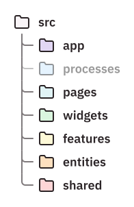

import { Aside } from '@astrojs/starlight/components';

Qatlamlar - Xususiyatlar bilan kesilgan dizayndagi tashkiliy ierarxiyaning birinchi darajasi. Ularning maqsadi kodni qanchalik mas'uliyatga muhtojligi va dasturda qancha boshqa modullarga bog'liqligi asosida ajratishdir.
<Aside>

Ushbu sahifada _module_ ilovadagi ichki modul - indeks fayli bo'lgan fayl yoki katalogni bildiradi. Npm paketlari bilan adashtirmaslik kerak.
</Aside>

Har bir qatlam o'ziga xos semantik ma'noga ega bo'lib, kodingizdagi modulga qanday mas'uliyat yuklanishi kerakligini aniqlashga yordam beradi. Qatlam nomlari va qiymatlari Feature-Sliced ​​Design yordamida qurilgan barcha loyihalar uchun standartlashtirilgan.
Hammasi bo'lib **7 ta qatlam** mavjud bo'lib, ular eng katta mas'uliyat va&nbsp;bog'liqlikdan tortib to eng kichikgacha tartiblangan:

1. App (Ilova)
2. Processes (Jarayonlar, eski qatlam)
2. Pages (Sahifalar)
3. Widgets (Vidjetlar)
4. Features (Ficha/funksiyalar)
5. Entities (Сущности)
6. Shared (Umumiy)

Loyihangizdagi barcha qatlamlardan foydalanish shart emas - faqat loyihangizga foyda keltiradigan qatlamlarni qo'shing.

## Qatlamlar uchun import qoidasi \{#import-rule-on-layers}

Qatlamlar _slices_ - kuchli bog'langan modullar guruhidan iborat. Xususiyatlarga ega Dilimlangan dizayn past ulanishni saqlaydi, shuning uchun bo'limlar orasidagi bog'liqliklar **qatlamlar uchun import qoidasi** bilan boshqariladi:

> _Slaysdagi modul faqat boshqa bo'limlarni quyidagi qatlamlarda joylashgan bo'lsagina import qilishi mumkin._

Masalan, `~/features/aaa` bo`limida bo`lak `aaa` bo`lgani uchun `~/features/aaa/api/request.ts` fayli `~/features/ papkasida biron bir moduldan kodni import qila olmaydi. bbb` , lekin `~/ob'ektlar` va `~/shared` dan, shuningdek, `~/features/aaa` qo`shni modullaridan kodni import qilishi mumkin.

## Qatlam ta'riflari

### Shared

Izolyatsiya qilingan modullar, komponentlar va abstraktsiyalar loyiha yoki biznes xususiyatlaridan ajralib turadi.
Ogohlantirish: Bu qatlamni [utility dump][ext--sova-utility-dump] sifatida ishlatmang!

Bu qatlam, boshqalardan farqli o'laroq, tilimlardan emas, balki to'g'ridan-to'g'ri segmentlardan iborat.

**Tarkibga misollar**:

* UI-biblioteka
* API-klient
* Brauzer API bilan ishlaydigan kod

### Entities

Loyihaning mohiyatini birgalikda tashkil etuvchi real dunyo tushunchalari. Odatda, bular korxona mahsulotni tavsiflash uchun foydalanadigan atamalardir.

Ushbu qatlamning har bir qismi statik UI elementlarini, ma'lumotlarni saqlashni va CRUD (Yaratish-O'qish-O'zgartirish-O'chirish) operatsiyalarini o'z ichiga oladi.

**Slayslar namunasi**:

<table>
  <thead><tr><th> Ijtimoiy tarmoq uchun </th><th> Git frontend uchun (masalan, GitHub) </th></tr></thead>
  <tbody>
  <tr><td><ul>
    <li>Foydalanuvchi</li>
    <li>Nashr</li>
    <li>Gruppa</li>
  </ul></td><td><ul>
    <li>Repezitoriy</li>
    <li>Fayl</li>
    <li>Kommit</li>
  </ul></td></tr>
  </tbody>
</table>

<Aside type="tip">

Git frontend misolida _repository_ faylida _fayllar mavjudligini ko'rishingiz mumkin. Bu omborni boshqa ob'ektlar joylashtirilgan yuqori darajadagi ob'ektga aylantiradi. Bu ob'ektlar uchun odatiy hol bo'lib, qatlamni import qilish qoidasini buzmasdan bunday yuqori darajadagi ob'ektlarga ega bo'lish ba'zan qiyin.

Bu muammoni hal qilish bo'yicha ba'zi tavsiyalar:
* Ob'ekt foydalanuvchi interfeysida quyi darajadagi ob'ektlar kiritiladigan joylar uchun slotlar bo'lishi kerak
* Ob'ektning o'zaro ta'siri bilan bog'liq biznes mantig'i "Xususiyatlar" ga joylashtirilishi kerak (ko'p hollarda)
* Ma'lumotlar bazasidan ob'ekt interfeyslari API mijozi yonidagi Umumiy qatlamga chiqarilishi mumkin

</Aside>

### Features

Foydalanuvchi o'zi uchun qimmatli natijaga erishish uchun tadbirkorlik sub'ektlari bilan o'zaro aloqada bo'lish uchun ilovada amalga oshirishi mumkin bo'lgan harakatlar. Shuningdek, u foydalanuvchi uchun qiymat yaratish uchun foydalanuvchi nomidan dastur bajaradigan amallarni ham o'z ichiga oladi.

Ushbu qatlamdagi bo'lak _interactive_ foydalanuvchi interfeysi elementlarini, ichki holatni va qiymat yaratuvchi amallarni bajarishga imkon beruvchi API so'rovlarini o'z ichiga olishi mumkin.

**Slayslar namunasi**:

<table>
  <thead><tr><th> Ijtimoiy tarmoq uchun </th><th> Git frontend uchun (masalan, GitHub) </th><th> Foydalanuvchi nomidan harakatlar </th></tr></thead>
  <tbody><tr><td><ul>
    <li>Tizimga kirish</li>
    <li>Post yaratish</li>
    <li>Guruhga qo'shilish</li>
  </ul></td><td><ul>
    <li>Fayl o'zgartirish</li>
    <li>Izoh qoldirish</li>
    <li>Vetkalarni birlashtirish</li>
  </ul></td><td><ul>
    <li>Tungi mavzuni avtomatik yoqish</li>
    <li>Orqa fonda hisob-kitoblarni bajarish</li>
    <li>User-Agent asosidagi harakatlar</li>
  </ul></td></tr></tbody></table>

### Widgets

O'z-o'zidan tuzilgan UI bloklari ob'ektlar va funktsiyalar kabi quyi darajadagi birliklar tarkibidan paydo bo'ldi.

Ushbu qatlam ob'ektlar interfeysida qolgan bo'shliqlarni boshqa ob'ektlar va funktsiyalardan interaktiv elementlar bilan to'ldirish imkoniyatini beradi. Shuning uchun biznes mantig'i odatda ushbu qatlamga joylashtirilmaydi, aksincha u xususiyatlarda saqlanadi. Ushbu qatlamdagi har bir bo'lak foydalanishga tayyor UI komponentlarini va ba'zan ishoralar, klaviatura o'zaro ta'siri va boshqalar kabi biznes bo'lmagan mantiqni o'z ichiga oladi.

Ba'zan ushbu qatlamga biznes mantiqini joylashtirish qulayroqdir. Ko'pincha, bu vidjet juda ko'p interaktivlikka ega (masalan, interaktiv jadvallar) va undagi biznes mantig'i qayta ishlatilmasa sodir bo'ladi.

**Slayslar namunasi**:

<table>
  <thead><tr><th> Ijtimoiy tarmoq uchun </th><th> Git frontend uchun (masalan, GitHub) </th></tr></thead>
  <tbody>
  <tr><td><ul>
    <li>Nashr kartasi</li>
    <li>Foydalanuvchi profili sarlavhasi (harakatlari bilan)</li>
  </ul></td><td><ul>
    <li>Ombordagi fayllarni ro'yxatlash (amallar bilan)</li>
    <li>Izohlar qatorida fikr bildiring</li>
    <li>Repozitoriy kartasi</li>
  </ul></td></tr>
  </tbody>
</table>

<Aside>

Agar siz ichki o'rnatilgan marshrutlash tizimidan foydalanayotgan bo'lsangiz (masalan, [Remix][ext--remix] router), Vidjetlar qatlamini tekis marshrutlash tizimidagi Sahifalar qatlamiga o'xshash tarzda ishlatish foydali bo'lishi mumkin - yaratish uchun backend, yuklash holatlari va xato cheklovchilaridan tegishli ma'lumotlarga ega to'liq huquqli interfeys bloklari. Bu yerda siz Sahifalar qatlami uchun tartiblarni ham joylashtirishingiz mumkin.
</Aside>

### Pages

Sahifa ilovalari uchun toʻliq sahifalar (masalan, veb-saytlar) yoki ekran ilovalari uchun ekranlar/faoliyatlar (masalan, mobil ilovalar).

O'zining kompozitsion tabiatiga ko'ra, bu qatlam kattaroq miqyosda bo'lsa-da, Vidjetlarga o'xshaydi. Ushbu qatlamdagi har bir bo'lak marshrutizatorga ulanishga tayyor foydalanuvchi interfeysi komponentlarini o'z ichiga oladi, shuningdek, ma'lumotlarni qabul qilish va xatolarni qayta ishlash uchun mantiqni o'z ichiga olishi mumkin.

**Slayslar namunasi**:

<table>
  <thead><tr><th> Ijtimoiy tarmoq uchun </th><th> Git frontend uchun (masalan, GitHub) </th></tr></thead>
  <tbody>
  <tr><td><ul>
    <li>Yangiliklar lentasi</li>
    <li>Jamiyat sahifasi</li>
    <li>Foydalanuvchi ommaviy profili</li>
  </ul></td><td><ul>
    <li>Repezitoriy sahifasi</li>
    <li>Foydalanuvchi repezitorisi</li>
    <li>Repezitoriydagi brenchlar</li>
  </ul></td></tr>
  </tbody>
</table>

### Processes

<Aside type="caution">

Этот слой считается устаревшим. Текущая версия спецификации рекомендует избегать его и перемещать его содержимое в `features` и `app`.

</Aside>

Murakkab ko'p sahifali shovqin talab qilinadigan vaziyatlardan chiqish yo'li.

Bu daraja ataylab aniqlanmagan holda qoldiriladi. Aksariyat ilovalar ushbu qatlamga muhtoj bo'lmaydi, yo'riqnoma va server darajasidagi mantiq Ilova darajasida qoldirilishi kerak. Ilova qatlami qo‘llab-quvvatlanmaydigan darajada kattalashganda va uni olib tashlash kerak bo‘lgandagina ushbu qatlamdan foydalanishni o‘ylab ko‘ring.

### App

Texnik ma'noda (masalan, kontekst provayderlari) va biznes ma'nosida (masalan, tahlil) butun dasturga tegishli bo'lgan har qanday narsa.

Bu qatlam odatda Shared kabi boʻlaklarni oʻz ichiga olmaydi, aksincha u toʻgʻridan-toʻgʻri segmentlarni oʻz ichiga oladi.

**Tarkibga misollar**:

* Stillar
* Router
* Ma'lumotlar do'konlari va boshqa kontekst provayderlari
* Analitika initsializatsiyasi

[ext--remix]: https://remix.run
[ext--sova-utility-dump]: https://sergeysova.com/ru/why-utils-and-helpers-is-a-dump/
