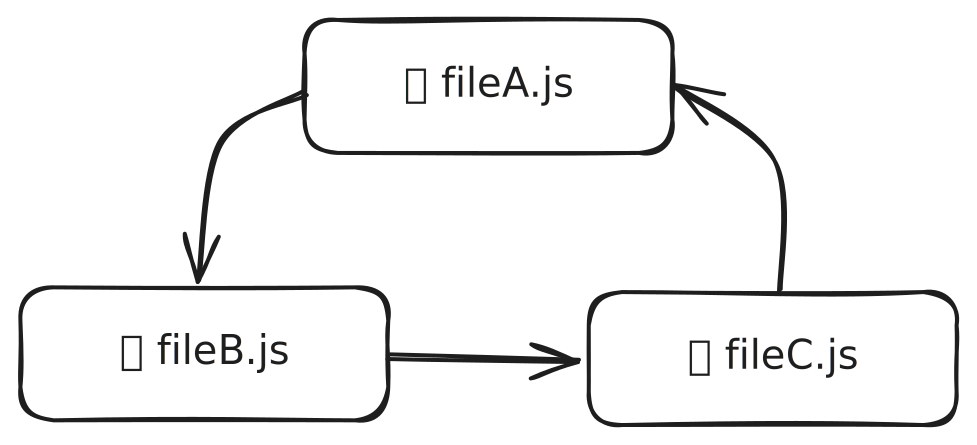

import { FileTree, Aside } from '@astrojs/starlight/components';

Public API là một _hợp đồng_ giữa một nhóm module, như một slice, và code sử dụng nó. Nó cũng hoạt động như một cổng kiểm soát, chỉ cho phép truy cập đến các đối tượng nhất định và chỉ thông qua public API đó.

Trong thực tế, nó thường được triển khai dưới dạng file index với các re-export:

```js title="pages/auth/index.js"
export { LoginPage } from "./ui/LoginPage";
export { RegisterPage } from "./ui/RegisterPage";
```

## Điều gì tạo nên một public API tốt?

Một public API tốt làm cho việc sử dụng và tích hợp slice vào code khác trở nên thuận tiện và đáng tin cậy. Điều này có thể đạt được bằng cách thiết lập ba mục tiêu sau:

1. Phần còn lại của ứng dụng phải được bảo vệ khỏi các thay đổi cấu trúc của slice, như refactoring
1. Những thay đổi đáng kể trong hành vi của slice mà phá vỡ các kỳ vọng trước đó phải gây ra thay đổi trong public API
1. Chỉ những phần cần thiết của slice mới nên được expose

Mục tiêu cuối cùng có một số hàm ý thực tế quan trọng. Có thể rất hấp dẫn khi tạo wildcard re-export cho mọi thứ, đặc biệt trong giai đoạn phát triển đầu của slice, vì bất kỳ đối tượng mới nào bạn export từ các file cũng sẽ tự động được export từ slice:

```js title="Bad practice, features/comments/index.js"
// ❌ BAD CODE BELOW, DON'T DO THIS
export * from "./ui/Comment";  // 👎 don't try this at home
export * from "./model/comments";  // 💩 this is bad practice
```

Điều này làm tổn hại khả năng khám phá của slice vì bạn không thể dễ dàng biết được interface của slice này là gì. Không biết interface có nghĩa là bạn phải đào sâu vào code của slice để hiểu cách tích hợp nó. Một vấn đề khác là bạn có thể vô tình expose các module internal, điều này sẽ khiến refactoring trở nên khó khăn nếu ai đó bắt đầu phụ thuộc vào chúng.

## Public API cho cross-imports \{#public-api-for-cross-imports}

Cross-import là tình huống khi một slice import từ slice khác trên cùng layer. Thông thường điều này bị cấm bởi [import rule on layers][import-rule-on-layers], nhưng thường có những lý do chính đáng để cross-import. Ví dụ, các business entity thường tham chiếu lẫn nhau trong thế giới thực, và tốt nhất là phản ánh những mối quan hệ này trong code thay vì tránh chúng.

Cho mục đích này, có một loại public API đặc biệt, còn được biết đến với tên gọi `@x`-notation. Nếu bạn có entity A và B, và entity B cần import từ entity A, thì entity A có thể khai báo một public API riêng chỉ dành cho entity B.

<FileTree>
- entities
  - A
    - @x
      - B.ts một public API đặc biệt chỉ dành cho code bên trong `entities/B/`
    - index.ts public API thông thường
</FileTree>

Sau đó code bên trong `entities/B/` có thể import từ `entities/A/@x/B`:

```ts
import type { EntityA } from "entities/A/@x/B";
```

Ký hiệu `A/@x/B` có nghĩa là "A crossed with B".

<Aside>

Hãy cố gắng giữ cross-import ở mức tối thiểu, và **chỉ sử dụng ký hiệu này trên layer Entities**, nơi mà việc loại bỏ cross-import thường là không hợp lý.

</Aside>

## Vấn đề với index file

Các index file như `index.js`, còn được gọi là barrel file, là cách phổ biến nhất để định nghĩa public API. Chúng dễ tạo, nhưng được biết đến là gây ra vấn đề với một số bundler và framework nhất định.

### Circular import

Circular import là khi hai hoặc nhiều file import lẫn nhau theo vòng tròn.

<figure>
    
    
    <figcaption>
        Minh họa ở trên: ba file, `fileA.js`, `fileB.js`, và `fileC.js`, import lẫn nhau theo vòng tròn.
    </figcaption>
</figure>

Những tình huống này thường khó khăn để bundler xử lý, và trong một số trường hợp chúng thậm chí có thể dẫn đến runtime error khó debug.

Circular import có thể xảy ra mà không cần index file, nhưng việc có index file tạo ra cơ hội rõ ràng để vô tình tạo circular import. Điều này thường xảy ra khi bạn có hai object được expose trong public API của slice, ví dụ `HomePage` và `loadUserStatistics`, và `HomePage` cần truy cập `loadUserStatistics`, nhưng nó làm như thế này:

```jsx title="pages/home/ui/HomePage.jsx"
import { loadUserStatistics } from "../"; // importing from pages/home/index.js

export function HomePage() { /* … */ }
```

```js title="pages/home/index.js"
export { HomePage } from "./ui/HomePage";
export { loadUserStatistics } from "./api/loadUserStatistics";
```

Tình huống này tạo ra circular import, vì `index.js` import `ui/HomePage.jsx`, nhưng `ui/HomePage.jsx` import `index.js`.

Để ngăn chặn vấn đề này, hãy xem xét hai nguyên tắc sau. Nếu bạn có hai file, và một file import từ file kia:
- Khi chúng ở trong cùng slice, luôn sử dụng import _relative_ và viết đầy đủ đường dẫn import
- Khi chúng ở trong các slice khác nhau, luôn sử dụng import _absolute_, ví dụ với alias

### Bundle lớn và tree-shaking bị hỏng trong Shared \{#large-bundles}

Một số bundler có thể gặp khó khăn trong việc tree-shake (loại bỏ code không được import) khi bạn có index file re-export mọi thứ.

Thông thường đây không phải là vấn đề cho public API, vì nội dung của một module thường có liên quan chặt chẽ với nhau, nên bạn hiếm khi cần import một thứ và tree-shake đi thứ khác. Tuy nhiên, có hai trường hợp rất phổ biến khi các quy tắc thông thường của public API trong FSD có thể dẫn đến vấn đề — `shared/ui` và `shared/lib`.

Hai folder này đều là tập hợp các thứ không liên quan mà thường không cần thiết tất cả ở một nơi. Ví dụ, `shared/ui` có thể có module cho mỗi component trong UI library:

<FileTree>
- shared/
  - ui/
    - button/
    - text-field/
    - carousel/
    - accordion/
</FileTree>

Vấn đề này trở nên tồi tệ hơn khi một trong những module này có dependency nặng, như syntax highlighter hoặc drag'n'drop library. Bạn không muốn kéo chúng vào mọi page sử dụng thứ gì đó từ `shared/ui`, ví dụ như một button.

Nếu bundle của bạn phát triển không mong muốn do một public API duy nhất trong `shared/ui` hoặc `shared/lib`, được khuyến nghị thay vào đó hãy có một index file riêng cho mỗi component hoặc library:

<FileTree>
- shared/
  - ui/
    - button/
      - index.js
    - text-field/
      - index.js
</FileTree>

Sau đó các consumer của những component này có thể import chúng trực tiếp như thế này:

```js title="pages/sign-in/ui/SignInPage.jsx"
import { Button } from '@/shared/ui/button';
import { TextField } from '@/shared/ui/text-field';
```

### Không có bảo vệ thực sự chống lại việc bỏ qua public API

Khi bạn tạo index file cho slice, bạn không thực sự cấm ai đó không sử dụng nó và import trực tiếp. Điều này đặc biệt là vấn đề với auto-import, vì có nhiều nơi mà một object có thể được import, nên IDE phải quyết định cho bạn. Đôi khi nó có thể chọn import trực tiếp, phá vỡ quy tắc public API trên slice.

Để tự động phát hiện những vấn đề này, chúng tôi khuyên sử dụng [Steiger][ext-steiger], một architectural linter với ruleset cho Feature-Sliced Design.

### Hiệu suất bundler kém hơn trên các dự án lớn

Việc có một lượng lớn index file trong dự án có thể làm chậm development server, như TkDodo đã lưu ý trong [bài viết "Please Stop Using Barrel Files"][ext-please-stop-using-barrel-files] của anh ấy.

Có một số điều bạn có thể làm để giải quyết vấn đề này:
1. Lời khuyên giống như trong vấn đề ["Bundle lớn và tree-shaking bị hỏng trong Shared"](#large-bundles) — có index file riêng cho từng component/library trong `shared/ui` và `shared/lib` thay vì một file lớn
2. Tránh có index file trong segment trên các layer có slice.  
   Ví dụ, nếu bạn có index cho feature "comments", `📄 features/comments/index.js`, thì không có lý do gì để có thêm index cho segment `ui` của feature đó, `📄 features/comments/ui/index.js`.
3. Nếu bạn có một dự án rất lớn, có khả năng cao là ứng dụng của bạn có thể được chia thành nhiều chunk lớn.  
   Ví dụ, Google Docs có trách nhiệm rất khác nhau cho document editor và file browser. Bạn có thể tạo monorepo setup nơi mỗi package là một FSD root riêng biệt, với bộ layer riêng. Một số package chỉ có thể có layer Shared và Entities, những package khác có thể chỉ có Pages và App, những package khác nữa có thể bao gồm Shared nhỏ của riêng mình, nhưng vẫn sử dụng cái lớn từ package khác.

[import-rule-on-layers]: /docs/reference/layers#import-rule-on-layers
[ext-steiger]: https://github.com/feature-sliced/steiger
[ext-please-stop-using-barrel-files]: https://tkdodo.eu/blog/please-stop-using-barrel-files
